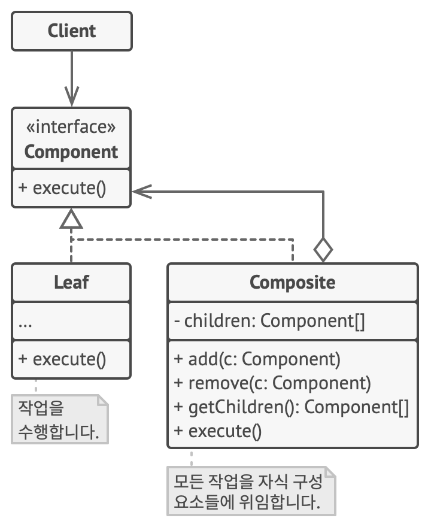

# 컴포지트 패턴(Composite Pattern)

## 컴포지트 패턴이란?

* 컴포지트 패턴은 부분-전체 계층 구조를 표한하는 데 사용됩니다.
* 이 패턴은 개별 객체와 객체 그룹(집합체)을 동일한 방법으로 취급하여 클라이언트 코드가 객체와 객체 그룹을 구별하지 않고 사용할 수 있도록 합니다.
* 주로 트리 구조와 같은 계층적 구조를 표현하거나 복합적인 객체를 처리할 때 사용됩니다.

## 컴포지트 패턴의 구성 요소

* 컴포넌트(Component) : 복합체 패턴의 모든 구성 요소에 대한 공통 인터페이스를 정의합니다. 이 인터페이스는 개별 객체와 집합체 모두에서 구현합니다.
* 리프(Leaf) : 개별 객체를 나타내며, 컴포넌트 인터페이스를 구현합니다. 이 객체는 더 이상 하위 객체를 가지지 않습니다.
* 컴포지트(Composite) : 집합체를 나타내며, 컴포넌트 인터페이스를 구현합니다. 이 객체는 하위 객체의 컬렉션을 관리하고, 이 하위 객체들을 자체적으로 컴포넌트 인터페이스를 구현합니다.

## 컴포지트 패턴의 장점

* 일관성 : 개별 객체와 복합 객체 모두 동일한 인터페이스를 공유하므로 클라이언트 코드에서 일관된 방식으로 처리할 수 있습니다.
* 재귀 구조 : 복합체 패턴은 트리 구조나 계층 구조를 모델링하기에 적합하며, 객체 간의 복잡한 관계를 나타낼 수 있습니다.
* 유연성 : 새로운 구성 요소를 쉽게 추가할 수 있으며, 복합 객체를 넣는 등의 유연한 구조를 갖을 수 있습니다.
* 클라이언트 코드 단순화 : 클라이언트 코드에서 객체와 그룹을 구분하지 않고 일관된 방법으로 처리할 수 있으므로 코드가 단순해집니다.

## 컴포지트 패턴의 단점

* 복잡성 : 대규모 복합체 구조를 구현할 때 복잡성이 증가할 수 있습니다. 객체 간의 관계를 관리하고 유지하는 것이 어려울 수 있습니다.
* 퍼포먼스 : 복합체 패턴은 개별 객체와 집합체를 동일하게 처리하므로, 일부 경우에는 성능 저하를 초래할 수 있습니다.

> 참조
> 
> 복합체 패턴(https://refactoring.guru/ko/design-patterns/composite)