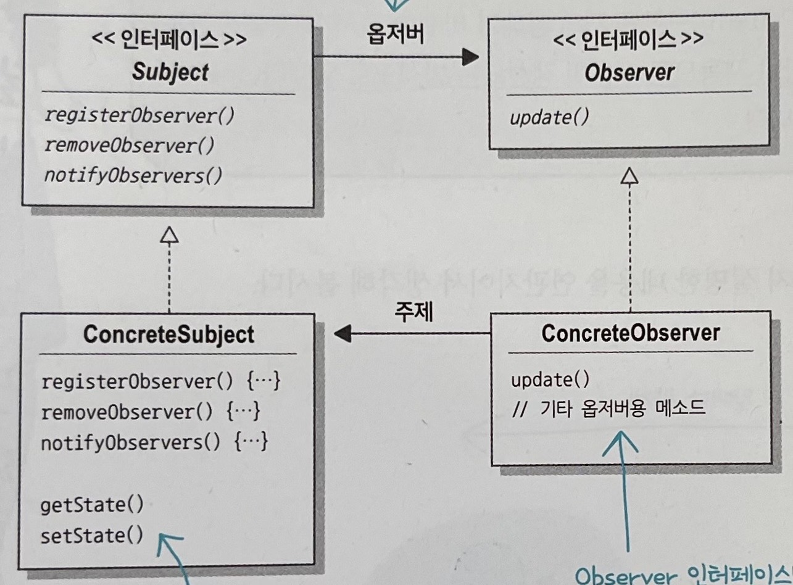
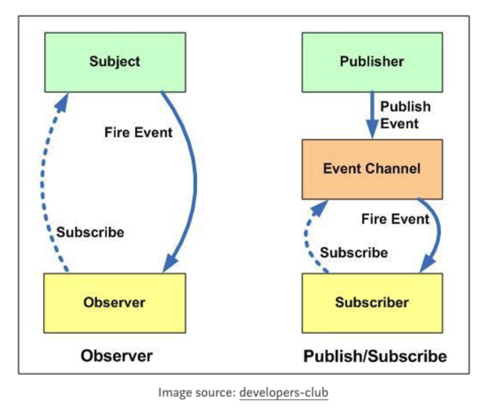

# Observer Pattern

## Observer Pattern이란?

* 옵저버 패턴은 한 객체의 상태가 바뀌면 그 객체의 의존하는 다른 객체에게 객체의 상태 변경에 대해서 전파하는 방식이며 일대다 의존성을 갖는다.

## 옵저버 패턴의 구성요소

* 주제(Subject) : 주제는 옵저버의 목록을 관리하며 주제 상태 변화를 알리기 위한 메서드를 제공하는 인터페이스입니다.
* 옵저버(Observer) : 옵저버는 주제의 상태 변화에 대해서 수신하며 이에 대해서 처리하는 인터페이스입니다.

## 옵저버 패턴의 느슨한 결합(Loose Coupling)

옵저버 패턴에서는 주제와 옵저버 모두 인터페이스로 구성되어 서로에 대해 잘 모르는 관계를 유지합니다. 이를 통해 두 객체의 느슨한 결합을 유지할 수 있습니다.

장점으로는 다음과 같습니다.

1. 객체들간의 상호 작용을 유연하게 만들어 줍니다.
2. 주제 객체는 옵저버들의 구체적인 클래스를 알지 않고도 상태 변화를 알릴 수 있습니다.
3. 새로운 옵저버를 추가하거나 제거하기가  쉽습니다.
4. 주제와 옵저버는 서로 독립적으로 재사용할 수 있습니다.
5. 주제나 옵저버가 바뀌더라도 서로한테 영향을 미치지 않습니다.

## 옵저버 패턴의 단점

* 옵저버 패턴을 사용하면 옵저버들이 주제의 상태를 업데이트하는데 시간이 걸리면 주제가 옵저버들을 모두 호출하는데 시간이 걸립니다. 이런 경우에는 옵저버들을 비동기적으로 호출하는 방법을 사용할 수 있습니다.

## 스프링에서 사용하는 유사 옵저버 패턴

* Spring Event : 스프링 event는 ApplicationEventPublisher를 통해 이벤트를 발행하고 ApplicationListener 인터페이스를 이용하여 이벤트 발행 객체를 수신할 수 있습니다. 또한 스프링의 Event는 동기적으로 작동합니다.
* Spring Webflux(Reactive Streams) : 스프링 WebFlux에서 Publisher, Subscriber 개념이 존재합니다. 이는 Reactive Streams에서 제공하는 개념으로 옵저버 패턴과 유사하게 Publisher를 통해 데이터를 Subscriber에게 전달합니다. 하지만 Spring Event와는 다르게 Publisher와 Subscriber는 다른 스레드에서 비동기적으로 작동합니다. Publicser와 Subscriber의 처리 성능이 차이가 날 수 있기 때문에 Subscriber에서 수신할 객체의 수를 조절하는 메서드를 제공합니다.  

