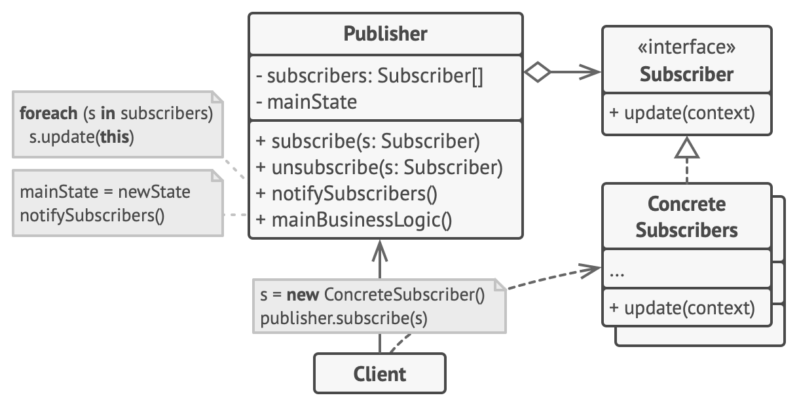

# 옵저버 패턴(Observer Pattern)

## 옵저버 패턴이란?

* 옵저버 패턴은 한 객체의 상태가 바뀌면 그 객체의 의존하는 다른 객체에게 객체의 상태 변경에 대해서 전파하는 방식이며 일대다 의존성을 갖는다.

## 옵저버 패턴의 구성요소

* 주제(Subject) : 주제는 옵저버의 목록을 관리하며 주제 상태 변화를 알리기 위한 메서드를 제공하는 인터페이스입니다.
* 옵저버(Observer) : 옵저버는 주제의 상태 변화에 대해서 수신하며 이에 대해서 처리하는 인터페이스입니다.

### 옵저버 패턴의 장점

* 느슨한 결합 : 주체와 옵저버들 사이에 느슨한 결합을 제공하여 서로에 대한 정보를 몰라도 됩니다. 이로써 객체 간의 의존성이 낮아져 유지보수와 확장이 용이해집니다.
* 상태 변화 감지와 분배: 주체 상태 변화를 감지하고, 이에 따른 옵저버들에게 자동으로 알림을 보내기 때문에 관련된 작업들이 즉시 수행될 수 있습니다.
* 확장성과 유연성 : 새로운 옵저버를 추가하거나 제거하여 쉽게 시스템을 확장하거나 유연하게 조정할 수 있습니다.

## 옵저버 패턴의 단점

* 순서에 의존적인 문제 : 옵저들의 순서가 중요한 경우, 제대로 된 순서를 유지하기 위해 추가적인 관리가 필요할 수 있습니다.
* 느린 성능 : 많은 옵저버들이 주체의 상태 변화를 감지하고 처리하는 과정에서 성능 저하기 발생할 수 있습니다.
* 메모리 누수 가능성: 주체와 옵저버들 간의 강한 참조 관계가 생길 경우, 객체가 소멸하지 않을 수 있어 메모리 누수가 발생할 수 있습니다.

---

> 참조자료 :
> 
> Spring WebFlux : https://zorba91.tistory.com/291
