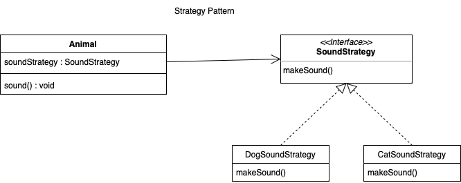

# 전략 패턴(Strategy Pattern)

* 전략 패턴은 알고리즘군을 정의하고 캡슐화해서 각각의 알고리즘군을 수정해서 쓸 수 있게 해 줍니다.
* 전략 패턴은 클라이언트의 알고리즘 사용과 구현을 분리하는 데 중점을 두고 있습니다.

## 전략 패턴 사용의 이점

* 알고리즘을 쉽게 확장하고 변경할 수 있습니다.
* 코드 재사용성과 유연성을 높일 수 있습니다.
* 클라이언트 코드는 구체적인 알고리즘에 종속되지 않으므로 유지보수가 용이해집니다.

## 전략패턴의 구성요소

* 전략(Strategy) : 알고리즘을 추상화한 인터페이스나 추상 클래스입니다.
* 구체적인 전략(Concrete Strategy) : 전략 인터페이스를 구현한 실제 알고리즘 클래스입니다.
* 환경(Context) : 전략 객체를 사용하는 클라이언트입니다. 환경은 전략 객체를 갖고 있으며, 실행 시에 적절한 전략을 선택하여 사용합니다.

## 코드

~~~java
public abstract class Animal {
    private SoundStrategy soundStrategy;
    
    public Animal(SoundStrategy soundStrategy){
        this.soundStrategy = soundStrategy;
    }
    
    public void sound(){
        soundStrategy.makeSound();
    }
    
    public void changeSound(SoundStrategy soundStrategy){
        this.soundStrategy = soundStrategy;
    }
}

public interface SoundStrategy{
    void makeSound();
}

public class DogSoundStrategy implements SoundStrategy{
    public void makeSound(){
        System.out.println("왈왈");
    }
}

public class CatSoundStrategy implements SoundStrategy{
    public void makeSound(){
        System.out.println("야옹");
    }
}
~~~

## UML

## 실행

~~~java
public class StrategyPatternExample {
    public static void main(String[] args) {
        Animal animal = new Animal(new DogSoundStrategy());
        animal.sound();

        animal.changeSound(new CatSoundStrategy());
        animal.sound();
    }
}
~~~
~~~
왈왈
야옹
~~~