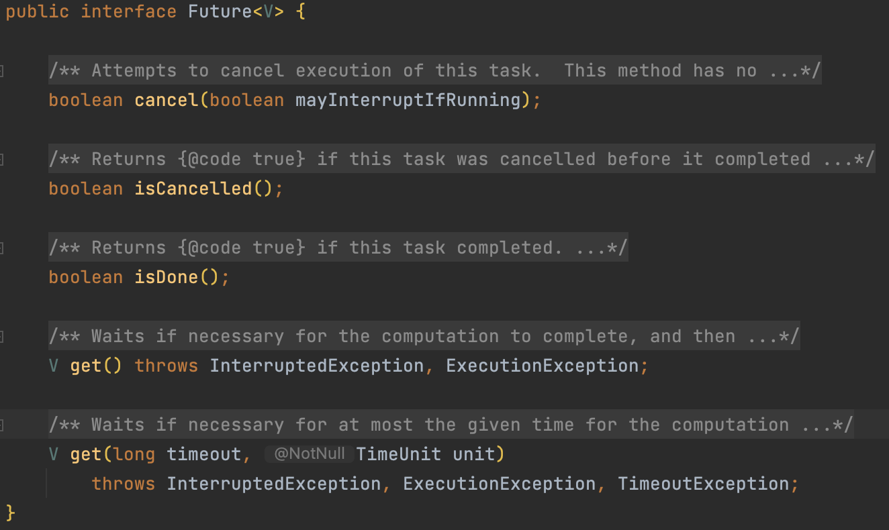
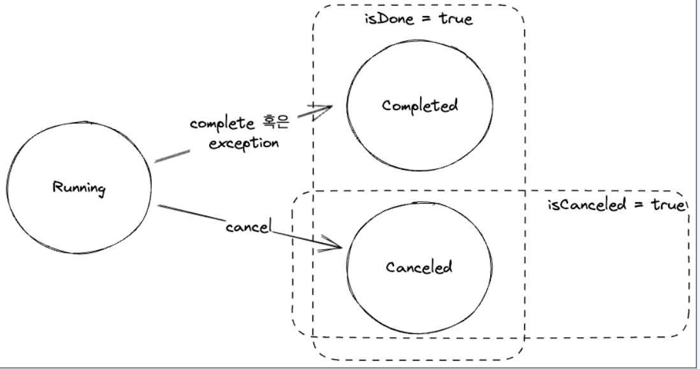

# Future

---

## Future 인터페이스

## ExecutorService

---

> An Executor that provides methods to manage termination and methods that can produce a Future for tracking progress of
> one or more asynchronous tasks.
>
> Executor는 종료를 관리할 수 있는 메소드와 하나 이상의 비동기 작업의 진행 상황을 추적할 수 있는 Future를 생성할 수 있는 메서드를 제공합니다.

* 스레드 풀을 이용하여 비동기적으로 작업을 실행하고 관리
* 별도의 스레드를 생성하고 관리하지 않아도 되므로, 코드를 간결하게 유지 가능
* 스레드 풀을 이용하여 자원을 효율적으로 관리

## ExecutorService 메서드

---

~~~java
public interface ExecutorService extends Executor {
    void execute(Runnable command);

    void shutdown();

    <T> Future<T> submit(Callable<T> task);

    <T> List<Future<T>> invokeAll(Collection<? extends Callable<T>> tasks);

    <T> T invokeAny(Collection<? extends Callable<T>> tasks);
}
~~~

* execute : Runnable 인터페이스를 구현한 작업을 스레드 풀에서 비동기로 실행
  > Executes the given command at some time in the future. The command may execute in a new thread, in a pooled thread,
  or in the calling thread, at the discretion of the Executor implementation.
* shutdown : ExecutorService를 종료. 더이상 새로운 작업을 받지 않음
  > Initiates an orderly shutdown in which previously submitted tasks are executed, but no new tasks will be accepted.
  Invocation has no additional effect if already shut down.
* submit : Callable 인터페이스를 구현한 작업을 스레드 풀에서 비동기적으로 실행하고, 해당작업의 결과를 Future<T> 객체로 리턴
  > Submits a value-returning task for execution and returns a Future representing the pending results of the task. The
  Future's get method will return the task's result upon successful completion.
* InvokeAll : Callable 인터페이스를 구현한 작업들을 스레드 풀에서 비동기적으로 실행하고, 모든 작업의 결과를 Future<T> 객체의 List로 리턴
  > Executes the given tasks, returning a list of Futures holding their status and results when all complete.
  Future.isDone() is true for each element of the returned list. Note that a completed task could have terminated either
  normally or by throwing an exception. The results of this method are undefined if the given collection is modified
  while this operation is in progress.
* InvokeAny : Callable 인터페이스를 구현한 작업들을 스레드 풀에서 비동기적으로 실행하고, 가장 먼저 완료되는 작업의 결과를 Future<T> 객체로 리턴
  > Executes the given tasks, returning the result of one that has completed successfully (i.e., without throwing an
  exception), if any do. Upon normal or exceptional return, tasks that have not completed are cancelled. The results of
  this method are undefined if the given collection is modified while this operation is in progress.

## ExecutorService 생성

---

* newSingleThreadExecutor : 스레드 풀에 스레드를 하나만 생성. 하나의 작업을 순차적으로 실행
* newFixedThreadPool : 스레드 풀에 스레드를 지정된 개수만큼 생성. 지정된 개수의 작업을 동시에 실행
* newCachedThreadPool : 사용가능한 스레드가 없다면 새로 생성해서 작업을 처리하고, 있다면 재사용. 스레드가 일정 시간 사용되지 않으면 회수
* newScheduledThreadPool : 스케줄링 기능을 갖춘 고정 크기의 스레드 풀을 생성. 주기적이거나 지연이 발생하는 작업을 실행
* newWorkStealingPool : work steal 알고리즘을 사용하는 ForkJoinPool을 생성

> Work Steal 알고리즘 : 일정수의 스레드를 생성하고 각 스레드는 독립적인 작업 큐를 가짐. 하나의 작업 큐가 비게되면 다른 작업 큐의 작업을 가져와 실행하는 방법

## FutureHelper 

---

~~~java
public class FutureHelper {
    public static Future<Integer> getFuture() {
        var executor = Executors.newSingleThreadExecutor();

        try {
            return executor.submit(() -> {
                return 1;
            });
        } finally {
            executor.shutdown();
        }
    }

    public static Future<Integer> getFutureCompleteAfter1s() {
        var executor = Executors.newSingleThreadExecutor();
        try {
            return executor.submit(() -> {
                Thread.sleep(1000);
                return 1;
            });
        } finally {
            executor.shutdown();
        }
    }
}
~~~

## Future : isDone, isCancelled

---

Future의 상태를 반환

* isDone : 작업이 완료되었는지 여부를 boolean으로 반환

> Returns true if this task completed. Completion may be due to normal termination, an exception, or cancellation -- in
> all of these cases, this method will return true.

* isCancelled : 작업이 취소되었는지 여부를 boolean으로 반환

> Returns true if this task was cancelled before it completed normally.

## Future : get

---

* 결과를 구할 때까지 스레드가 계속 block
* future에서 무한 루프나 오랜 시간이 걸린다면 스레드가 blocking 유지

~~~java
public class FutureGetExample {
    public void get() {
        Future future = FutureHelper.getFuture();
        assert !future.isDone();
        assert !future.isCancelled();

        var result = future.get();
        assert result.equals(1);
        assert future.isDone();
        assert !future.isCancelled();
    }
}
~~~

## Future : get(timeout)

---

* timeout 시간이 지나면 TimeoutException 발생

~~~java
public class FutureGetTimeoutExample {
    public void getTimeOut() {
        Future future = FutureHelper.getFutureCompleteAfter1s();
        var result = future.get(1500, TimeUnit.MILLISECONDS);
        assert result.equals(1);

        Future futureTimeout = FutureHelper.getFutureCompleteAfter1s();
        Exception exception = null;
        try {
            var result = future.get(500, TimeUnit.MILLISECONDS);
        } catch (TimeoutException e) {
            exception = e;
        }
        assert exception != null;
    }
}
~~~

## Future : cancel

---

* 작업을 취소하고, 작업이 이미 완료되었거나 취소되었다면 false를 반환
* myInterruptRunning이 false라면 시작하지 않은 작업에 대해서만 취소

~~~java
public class FutureCancelExample {
    public void cancel() {
        Future future = FutureHelper.getFuture();
        var result = future.cancel(true);
        assert result;
        assert future.isCancelled();
        assert future.isDone();
        
        result = future.cancel(true);
        assert !result;
        assert future.isCancelled();
        assert future.isDone();
    }
}
~~~

## Future 인터페이스의 한계

---

* cancel을 제외하고 외부에서 future를 컨트롤할 수 없다.
* 결과를 get() 해서 접근하기 때문에 비동기 처리가 어렵다.
* 완료되거나 에러가 발생하는 상황에서 Future의 inDone은 모두 true를 반환하기 떄문에 에러 발생 여부를 구분하기 어렵다.