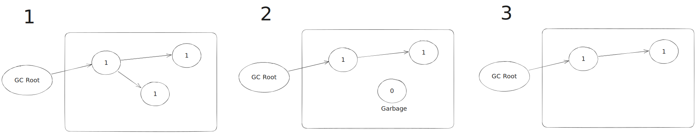
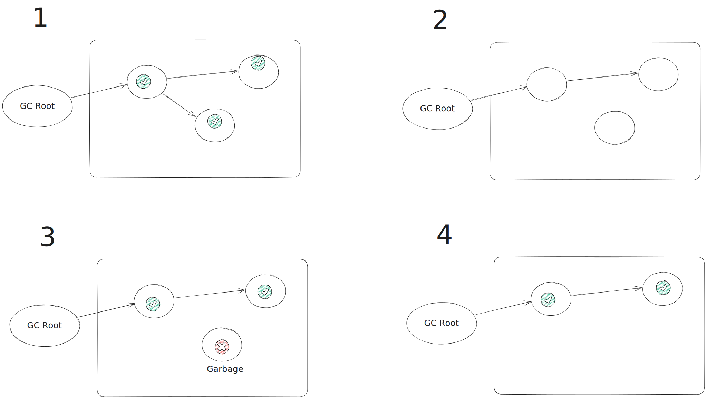
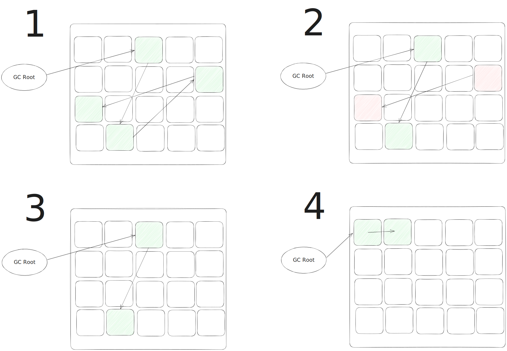
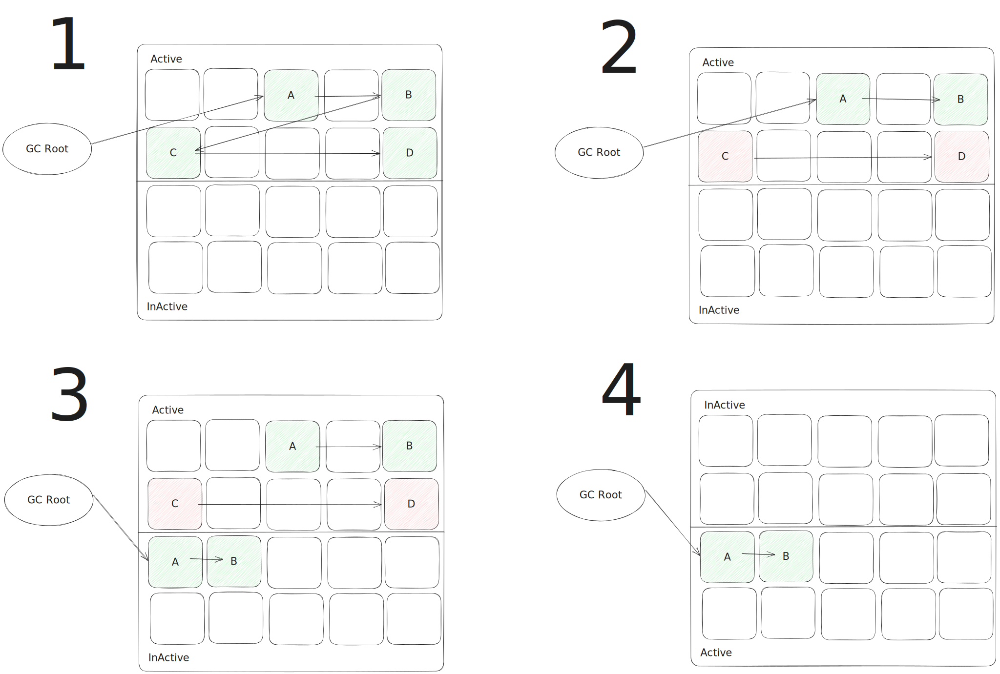
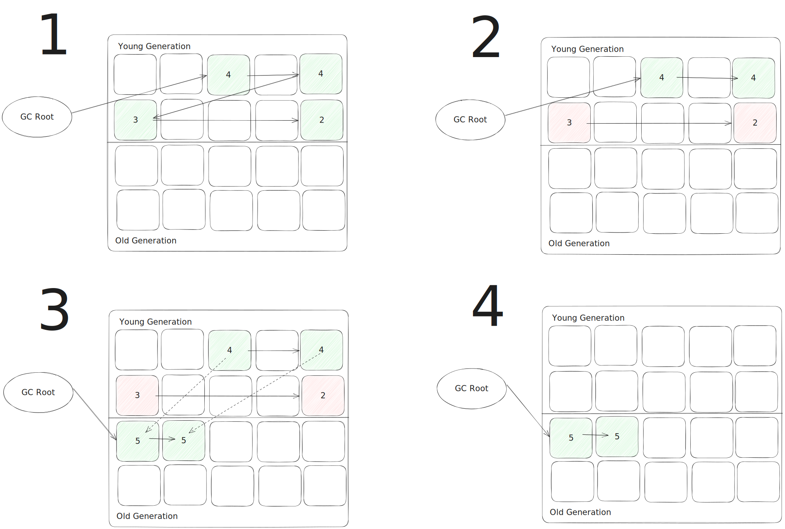

## GC 알고리즘

GC 알고리즘으로는 다음과 같은 알고리즘이 있습니다.
* Reference Counting
* Mark And Sweep
* Mark And Compact
* Copying
* Generational

## Reference Counting

Reference Counting 알고리즘은 객체가 참조되는 횟수를 세는 알고리즘입니다. Reference Counting 알고리즘은 다음과 같은 과정으로 이루어집니다.

1. 각 객체는 참조되는 횟수를 나타내는 reference count를 가지고있습니다.
2. 참조가 없다면 refrence count는 0이 됩니다.
3. reference count가 0인 객체는 메모리 해제 대상이 됩니다.

### Reference Counting 장점

* 간단하고 예측 가능한 알고리즘으로, 구현이 비교적 쉽습니다.
* 객체가 더 이상 사용되지 않으면 즉시 해제될 수 있어 메모리 누수를 방지할 수 있습니다.
* GC 작업이 다른 작업과 병행되어 프로그램 응답성을 높일 수 있습니다.

### Reference Counting 단점

* 순환 참조 문제를 처리하지 못합니다. A 객체와 B 객체 서로서로 참조하는 상황이라면 reference count가 0이 되지않아 메모리 누수가 발생할 수 있습니다.
* Reference Counting은 참조 횟수를 추적하기 위한 오버헤드가 있으며, 이로 인해 일반적인 연산보다 성능이 느릴 수 있습니다.

## Mark And Sweep

Mark And Sweep 알고리즘은 GC의 가장 기본적인 알고리즘입니다. Mark And Sweep 알고리즘은 다음과 같은 과정으로 이루어집니다.

1. 할당 리스트를 순회하면서 마크 비트를 지운다.
2. GC 루트부터 살아 있는 객체를 찾는다.
3. 이렇게 찾은 객체마다 마크 비트를 세팅한다.(Marking 단계)
4. 할당 리스트를 순회하면서 마크 비트가 세팅되지 않은 객체를 찾는다. (Sweep 단계)
    * 힙에서 메모리를 회수해 프리 리스트에 되돌린다.
    * 할당 리스트에서 객체를 삭제한다.

### Mark And Sweep 장점

* 순환 참조 문제를 다룰 수 있습니다.
* 마크 단계에서 실제로 도달 가능한 객체만 마크되므로 정확한 결과를 얻을 수 있습니다.

### Mark And Sweep 단점

* 스윕 단계에서 마크되지 않은 객체를 해제하기 위해 모든 메모리를 스캔해야 하므로, 객체의 개수나 메모리 크기가 클 경우 성능이 저하될 수 있습니다.
* 스윕 단계에서 해제되는 객체들이 연속적으로 배치되지 않을 수 있어 메모리 단편화가 발생할 수 있습니다.
* 마킹 단계와 스윕 단계 사이에는 일시적으로 GC 동작으로 프로그램의 일시 중단이 발생할 수 있습니다.

## Mark And Compact

Mark And Compact 알고리즘은 Mark And Sweep 알고리즘의 메모리 단편화 문제를 해소하기 위해 고안된 알고리즘입니다. Mark And Compact 알고리즘은 다음과 같은 과정으로 이루어집니다.

1. 할당 리스트를 순회하면서 마크 비트를 지운다.
2. GC 루트부터 살아 있는 객체를 찾는다. 이렇게 찾은 객체마다 마크 비트를 세팅한다.(Marking 단계)
3. 할당 리스트를 순회하면서 마크 비트가 세팅되지 않은 객체를 찾는다. (Sweep 단계)
    * 힙에서 메모리를 회수해 프리 리스트에 되돌린다.
    * 할당 리스트에서 객체를 삭제한다.
4. 프리 리스트에 있는 객체들을 한 곳으로 모은다.(Compacting 단계)
    * 객체를 한 곳으로 모으면서 객체의 주소를 조정한다.
    * 객체의 주소가 조정되었으므로 GC 루트를 업데이트한다.

### Mark And Compact 장점

* 메모리 단편화를 해소하여 공간 효율성을 향상시킵니다. 메모리 단편화로 인해 발생하는 공간 낭비를 최소화하며, 메모리를 더 효율적으로 사용할 수 있습니다.
* 컴팩트 단계를 통해 메모리 공간을 연속적으로 배치하여 읽기와 쓰기 성능을 향상시킬 수 있습니다.

### Mark And Compact 단점

* 컴팩트 단계에서 객체 이동이 발생하므로 일시적으로 GC 동작으로 인해 프로그램의 일시 중단이 발생할 수 있습니다.
* 객체 이동으로 인해 참조 관계가 변경될 수 있으므로, 이에 대한 처리가 필요할 수 있습니다.

## Copying

Copying 알고리즘은 Mark And Sweep 알고리즘의 메모리 단편화 문제를 해소하기 위해 고안된 알고리즘입니다. Copying 알고리즘은 다음과 같은 과정으로 이루어집니다.

1. 할당 리스트를 순회하면서 마크 비트를 지운다.
2. GC 루트부터 살아 있는 객체를 찾는다. 이렇게 찾은 객체마다 마크 비트를 세팅한다.(Marking 단계)
3. 할당 리스트를 순회하면서 마크 비트가 세팅된 객체를 InActive 영역에 복사하고 객체간의 참조를 업데이트 한다.(Copying 단계)
4. 기존 Active 영역의 Garbage 객체를 해지하면 Free Memory 영역이 되고 Active 영역과 InActive 영역을 교체한다.

### Copying 장점

* 메모리 단편화 문제를 해결하여 메모리 공간을 더 효율적으로 사용할 수 있습니다.
* 객체들을 연속적으로 배치하여 읽기와 쓰기 성능을 향상시킬 수 있습니다.
* 객체가 복사되는 동안에만 중단이 발생하므로, GC 동작이 상대적으로 짧은 시간에 끝납니다.

### Copying 단점

* 모든 객체를 복사해야 하므로 메모리 전체 크기가 커질 수 있습니다. 이로 인해 메모리 사용량이 증가할 수 있습니다.
* 복사 과정에서 객체들을 올기기 때문에 참조 관계를 갱신해야 하며, 이에 따른 추가적인 작업이 필요합니다.
* 오래된 객체들을 다루는 데에는 비효율적일 수 있습니다.

## Generational

Generational 알고리즘은 약한 세대별 가설(Weak Generational Hypothesis)에 따라 Young Generation과 Old Generation이라는 영역으로 Heap을 구분지었습니다.

Young Generation 영역이 가득차 GC가 발생하면 Minor GC, Young Generation GC라고 합니다.

Old Generation 영역이 가득차 GC가 발생하면 Major GC, Full GC라고 합니다.

약한 세대별 가설은 다음 두 가지 가정을 기반으로 합니다.
* 대부분의 할달된 객체는 오랫동안 참조되지 않으며 금방 Garbage 대상이 됩니다.
* 늙은 객체가 젊은 객체를 참조할 일은 거의 없습니다.

Generational 알고리즘은 다음과 같은 과정으로 이루어집니다.

1. 할당 리스트를 순회하면서 마크 비트를 지운다.
2. GC 루트부터 살아 있는 객체를 찾는다. 이렇게 찾은 객체마다 마크 비트를 세팅한다.(Marking 단계)
3. 할당 리스트를 순회하면서 마크 비트가 세팅된 객체를 찾아 Age(GC에서 살아남은 횟수)를 증가시키며 비트가 세팅되지 않은 객체는 삭제한다.
4. 일정 기준 이상의 Age를 가지는 객체는 Old Generation으로 옮긴다.

### Generational 장점

* 대부분의 객체가 짧은 수명을 가지고 빨리 가비지가 되는 특성을 고려하여 성능을 향상시킬 수 있습니다.
* 신규 생성 객체와 늙은 객체를 나누어 처리함으로써 GC의 작업 부담을 줄일 수 있습니다.

### Generational 단점

* 객체를 세대별로 분류하고 유지하는 데 추가적인 관리 비용이 발생할 수 있습니다.
* 객체의 수명 패턴에 따라 GC의 성능이 크게 달리질 수 있으며, 일부 상황에서는 효과가 떨어질 수 있습니다.

> 참조
>
> [JVM] Garbage Collection Algorithms(https://medium.com/@joongwon/jvm-garbage-collection-algorithms-3869b7b0aa6f)