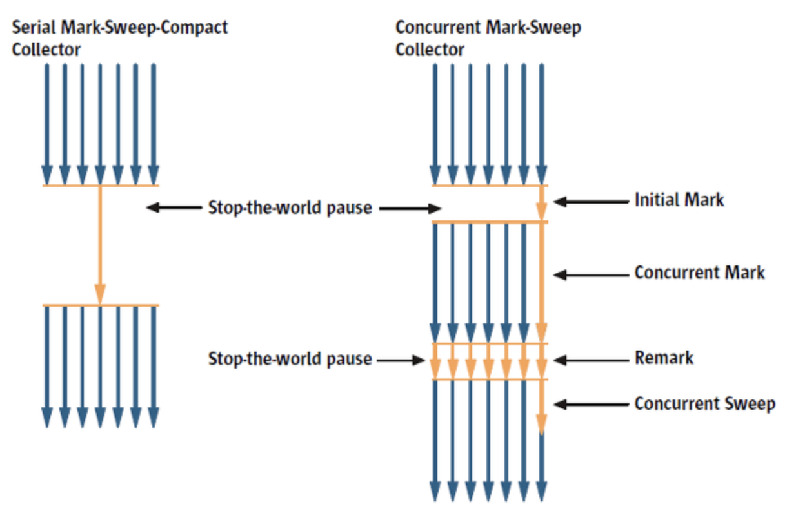

## GC 종류

## Serial GC

### Serial GC 란?

 

* 단일 스레드에서 실행되는 GC입니다.
* 세대 기반 GC입니다.

### Serial GC 장점

* 간단함 : Serial GC는 단일 스레드로 작동하기 때문에 구현이 단순하며, 메모리 관리와 가비지 컬렉션에 대한 이해가 쉽습니다.

### Serial GC 단점

* STW(Stop The World) 현상: 가장 큰 단점 중 하나로, 가비지 컬렉션 작업 중에 모든 애플리케이션 스레드가 정지되므로 응답성이 떨어질 수 있습니다.
* 멀티코어 시스템에서 제한 : Serial GC는 단일 스레드로 작동하기 때문에 멀티코어 시스템에서는 제한된 성능을 보일 수 있습니다.

## Parallel GC

### Parallel GC 란?

* Serial GC와 유사하지만, Parallel GC는 여러 스레드를 사용하여 가비지 컬렉션 작업을 수행합니다.
* 세대 기반 GC입니다.

### Parallel GC 장점

* 높은 처리량 : 멀티스레드를 사용하여 병렬 처리를 수행하므로, 대량의 데이터를 빠르게 처리할 수 있습니다.
* STW(Stop The World) 시간 감소 : 멀티스레드를 사용하여 가비지 컬렉션 작업을 수행하므로, 가비지 컬렉션 작업 시간이 단일 스레드보다 짧습니다.

### Parallel GC 단점

* CPU 부하 : 병렬 처리를 위해 여러 스레드를 사용하므로, CPU 사용량이 높아질 수 있습니다.
* 메모리 오버헤드 : 다른 병렬 GC 알고리즘에 비해 메모리 사용량이 증가할 수 있습니다.
* STW(Stop The World) 현상 : 가비지 컬렉션 작업 중에 모든 애플리케이션 스레드가 정지되므로 응답성이 떨어질 수 있습니다.

## CMS GC

### CMS GC 란?

* CMS GC는 Concurrent Mark Sweep의 약자로, STW(Stop The World) 시간을 줄이기 위해 개발된 GC입니다.
* 테뉴어드(올드) 세대 전용 수집기입니다. 보통 영 세대 수집용 병렬 수집기 ParNew와 함께 사용합니다.
* CMS GC는 STW 시간을 줄이기 위해 애플리케이션 스레드 실행 중에 가급적 많은 일을 수행합니다.

### CMS GC 수행 단계

1. 초기 마킹(Initial Mark, STW) : STW 시간 동안, Root 객체들을 통해 올드 영역의 도달 가능한 객체들을 표시합니다.
2. 동시 마킹(Concurrent Mark) : 애플리케이션의 실행과 병행하며, 추가적인 도달 가능한 객체를 표시합니다.
3. 동시 사전 정리(Concurrent Preclean) : 표시된 객체 중 수정되지 않은 객체를 정리하며, 추후 업데이트가 더 빠르게 진행되도록 준비합니다.
4. 최종 마킹(Remark, STW) : STW 시간 동안, 마지막으로 도달 가능한 객체들을 표시합니다.
5. 동시 수집(Concurrent Sweep) : 도달 가능하지 않은 객체들을 병렬 처리하여 메모리를 헤제합니다. 이 단계에서는 STW가 발생하지 않습니다.
6. 동시 초기화(Concurrent Reset) : 가비지 컬렉션과 관련된 데이터를 초기화합니다.

### CMS GC 장점

* 응답성 향상 : 가장 큰 장점 중 하나로 STW 시간을 줄여 응답성을 향상시킵니다.

### CMS GC 단점

* CPU 부하 : 병행 처리를 위해 여러 스레드를 사용하므로, CPU 사용량이 높아질 수 있습니다.
* 메모리 단편화 : CMS는 Compact 단계가 없기 때문에 올드 영역에서 메모리 단편화가 발생할 수 있습니다.

## G1 GC

### G1 GC 란?

* G1 GC는 Garbage First의 약자로, Java 9부터 디폴트인 GC 입니다.
* G1 GC는 대용량 메모리가 있는 다중 프로세스 시스템을 대상으로 하는 서버-스타일 GC 입니다.
* G1 GC는 영역을 Region이라는 작은 단위로 나누어 관리합니다.

### G1 GC 수행 단계

1. 초기 마킹(Initial Mark, STW) : STW 시간 동안, Root 객체들을 통해 올드 영역의 도달 가능한 객체들을 표시합니다.
2. 동시 루트 탐색(Root Region Scan) : 올드 영역의 Root 객체들을 통해 도달 가능한 객체들을 표시합니다. 
3. 동시 마킹(Concurrent Mark) : 전체 힙의 Region에 대해 스캔 작업을 진행하며, GC 대상 객체가 발견되지 않은 Region은 이후 단계를 처리하는데 제외되도록 합니다.
4. 최종 마킹(Remark, STW) : STW 시간 동안, 마지막으로 도달 가능한 객체들을 표시합니다.
5. 병렬 정리(Concurrent Cleanup, STW) : 도달 가능하지 않은 객체들을 병렬 처리하여 메모리를 헤제합니다.
6. 재정렬(Copy, STW) : 도달 가능한 객체들을 연속된 메모리 블록에 복사합니다.

### G1 GC 장점

* 응답성 향상 : 가장 큰 장점 중 하나로 STW 시간을 줄여 응답성을 향상시킵니다.
* 메모리 단편화 감소 : G1 GC는 영역을 Region이라는 작은 단위로 나누어 관리하므로, 메모리 단편화가 발생할 확률이 줄어듭니다.
* 예측 가능한 STW 시간 : G1 GC는 Region 단위로 GC를 진행하므로, STW 시간을 예측하기 쉬워집니다.

### G1 GC 단점

* CPU 사용량 증가 : G1 GC는 병렬 처리를 위해 여러 스레드를 사용하므로, CPU 사용량이 높아질 수 있습니다.

## Z GC(추가 정리 필요)

### Z GC 란?

* ZGC는 대규모 메모리와 최소한의 STW 시간을 필요로 하는 애플리케이션에서 사용되는 알고리즘입니다.
* ZGC는 영역을 Region이라는 작은 단위로 나누어 관리합니다.

### Z GC 장점

* 매우 짧은 정지 시간 : ZGC는 정지 시간을 몇 밀리초에서 최대 수 밀리초로 유지하면서 GC를 수행합니다. 이는 실시간성을 유지하는데 매우 유리합니다.
* 대규모 메모리 지원 : ZGC는 매우 큰 힙 크기도 지원하므로 대규모 메모리를 필요로 하는 애플리케이션에서도 사용할 수 있습니다.
* 메모리 단편화 감소 : ZGC는 영역을 Region이라는 작은 단위로 나누어 관리하므로, 메모리 단편화가 발생할 확률이 줄어듭니다.

### Z GC 단점

* CPU 부하 : 병행 처리를 위해 여러 스레드를 사용하므로, CPU 사용량이 높아질 수 있습니다.
* 복사 비용 : ZGC는 재정렬(Copy) 단계에서 도달 가능한 객체들을 연속된 메모리 블록에 복사합니다. 이 과정에서 복사 비용이 발생합니다.

> 참조
> 
> Garbage Collection Part2(https://ktko.tistory.com/entry/Garbage-Collection-Part2)
> 
> Java: Z Garbage Collection(ZGC)(https://choiseokwon.tistory.com/373)