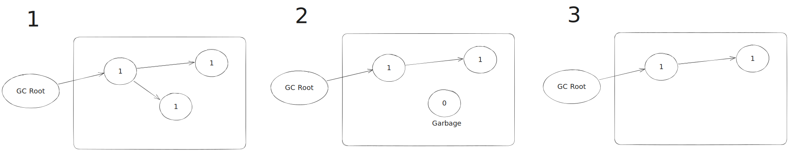
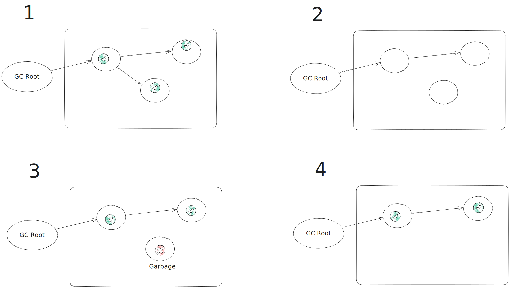

# 가비지 컬랙션(GC)

## 가비지 컬랙션(GC)이란?

* GC는 JVM에서 사용하지 않는 메모리를 감지하고 회수하는 프로세스입니다.

## GC 알고리즘

GC 알고리즘으로는 대표적으로 다음 두가지가 있습니다.
* Reference Counting
* Mark And Sweep

## Reference Counting

Reference Counting 알고리즘은 객체가 참조되는 횟수를 세는 알고리즘입니다. Reference Counting 알고리즘은 다음과 같은 과정으로 이루어집니다.

1. 각 객체는 참조되는 횟수를 나타내는 reference count를 가지고있습니다.
2. 참조가 없다면 refrence count는 0이 됩니다.
3. reference count가 0인 객체는 메모리 해제 대상이 됩니다.

### Reference Counting 장점

* 간단하고 예측 가능한 알고리즘으로, 구현이 비교적 쉽습니다.
* 객체가 더 이상 사용되지 않으면 즉시 해제될 수 있어 메모리 누수를 방지할 수 있습니다.
* GC 작업이 다른 작업과 병행되어 프로그램 응답성을 높일 수 있습니다.

### Reference Counting 단점

* 순환 참조 문제를 처리하지 못합니다. A 객체와 B 객체 서로서로 참조하는 상황이라면 reference count가 0이 되지않아 메모리 누수가 발생할 수 있습니다.
* Reference Counting은 참조 횟수를 추적하기 위한 오버헤드가 있으며, 이로 인해 일반적인 연산보다 성능이 느릴 수 있습니다.

## Mark And Sweep

Mark And Sweep 알고리즘은 GC의 가장 기본적인 알고리즘입니다. Mark And Sweep 알고리즘은 다음과 같은 과정으로 이루어집니다.

1. 할당 리스트를 순회하면서 마크 비트를 지운다.
2. GC 루트부터 살아 있는 객체를 찾는다.
3. 이렇게 찾은 객체마다 마크 비트를 세팅한다.(Marking 단계)
4. 할당 리스트를 순회하면서 마크 비트가 세팅되지 않은 객체를 찾는다. (Sweep 단계)
   * 힙에서 메모리를 회수해 프리 리스트에 되돌린다.
   * 할당 리스트에서 객체를 삭제한다.

### Mark And Sweep 장점

* 순환 참조 문제를 다룰 수 있습니다.
* 마크 단계에서 실제로 도달 가능한 객체만 마크되므로 정확한 결과를 얻을 수 있습니다.

### Mark And Sweep 단점

* 스윕 단계에서 마크되지 않은 객체를 해제하기 위해 모든 메모리를 스캔해야 하므로, 객체의 개수나 메모리 크기가 클 경우 성능이 저하될 수 있습니다.
* 스윕 단계에서 해제되는 객체들이 연속적으로 배치되지 않을 수 있어 메모리 단편화가 발생할 수 있습니다.
* 마킹 단계와 스윕 단계 사이에는 일시적으로 GC 동작으로 프로그램의 일시 중단이 발생할 수 있습니다.

