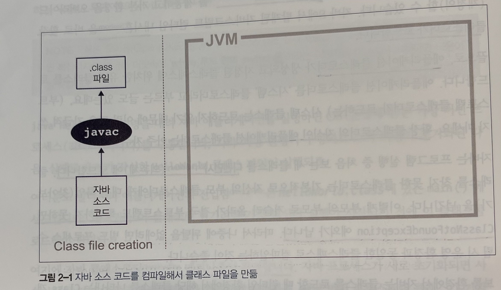
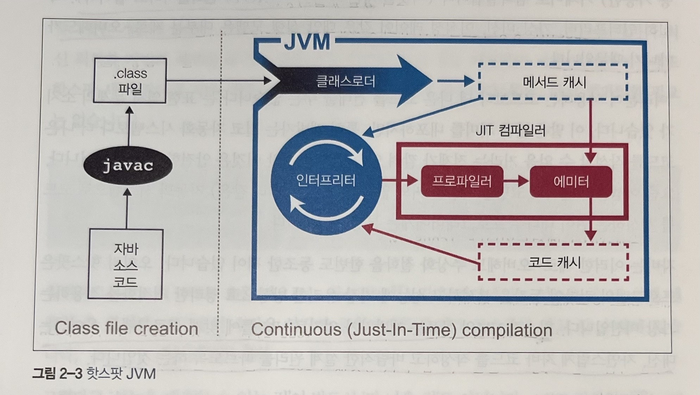

# JVM

## 인터프리팅과 클래스 로딩

JVM은 스택 기반의 해석 머신입니다. 물리적인 CPU 하드웨어인 레지스터는 없지만 일부 결과를 실행 스택에 보관하며, 이 스택의 맨 위에 쌓인 값들을 가져와 계산을 합니다.

자바의 클래스로딩 메커니즘은 다음과 같습니다.

1. 부트스트랩 클래스가 자바 런타임 코어 클래스를 로드합니다.
2. 확장 클래스로더가 생기며, 부트스트랩 클래스로더를 자기 부모로 설정하고 필요할 때 클래스로딩 작업을 부모에게 넘깁니다.
3. 애플리케이션 클래스로더가 생성되고 지정된 클래스패스에 위치한 클래스를 로드합니다.

자바는 프로그램 실행 중 처음 보는 새 클래스를 디펜던시(의존체)에 로드합니다. 클래스를 찾지 못한 클래스로더는 기본적으로 부모 클래스로더에게 대신 룩업(찾아보기)을 넘깁니다. 이러한 과정에서 최상위 클래스로더에서도
찾지 못한다면 `ClassNotFoundException`이 발생합니다.

한 시스템에서 클래스는 (패키지명을 포함한) 풀 클래스명과 자신을 로드한 클래스로더, 두 가지 정보로 식별됩니다.

## 바이트코드 실행

자바 컴파일러 javac를 이용하여 자바 소스 코드를 바이트 코드로 구성된 .class 파일로 변환합니다.

바이트코드는 특정 컴퓨터 아키텍처에 특정하지 않은, 중간 표현형(IR)입니다. 따라서 컴파일이 완료된 소프트웨어는 JVM 지원 플랫폼 어디서건 실행이 가능합니다. 또한 자바 언어에 대해서도 특정하지 않습니다. 따라서
JVM 규격을 따른다면 다른 언어로 작성된 소프트웨어도 JVM에서 실행할 수 있습니다.

컴파일러가 생성한 클래스 파일은 다음의 데이터를 갖추고 있습니다.

| 컴포넌트         | 설명                                |
|:-------------|:----------------------------------|
| 매직 넘버        | 클래스 파일의 첫 4바이트는 항상 0xCAFEBABE입니다. |
| 클래스 파일 포맷 버전 | 클래스 파일의 메이저/마이너 버전                |
| 상수 풀         | 클래스 상수들이 모여 있는 위치                 |
| 액세스 플래그      | 추상 클래스, 정적 클래스 등 클래스 종류를 표시       |
| this 클래스     | 현재 클래스 명                          |
| 슈퍼클래스        | 슈퍼클래스(부모클래스)명                     |
| 인터페이스        | 클래스가 구현한 모든 인터페이스                 |
| 필드           | 클래스에 들어 있는 모든 필드                  |
| 메서드          | 클래스에 들어 있는 모든 메서드                 |
| 속성           | 클래스가 지닌 모든 속성(예: 소스 파일명 등)        |

JVM은 코드를 실행할 때 런타임에 배치된 메모리 대신, 상수 풀 테이블을 찾아보고 필요한 값을 참조합니다.

## 핫스팟

핫스팟은 프로그램의 런타임 동작을 분석하고 성능에 가장 유리한 방향으로 영리한 최적화를 적용하는 가상 머신입니다.

## JIT 컴파일러

자바 프로그램은 바이트코드를 인터프리터가 가상화한 스택 머신에서 명령어를 실행하며 시작됩니다. CPU를 추상화한 구조라서 다른 플랫폼에서도 클래스 파일을 문제없이 실행할 수 있지만, 프로그램이 성능을 최대로 내려면 네이티브 기능을 활용해 CPU에서 직접 프로그램을 실행시켜야 합니다.

이를 위해 핫스팟은 프로그램 단위를 인터프리티드 바이트코드에서 네이티브 코드로 컴파일합니다. 이 기술이 JIT 컴파일이라고 부릅니다.

핫스팟은 인터프리티 모드로 실행하는 동안 애플리케이션을 모니터링하면서 가장 자주 실행되는 코드 파트를 발견해 JIT 컴파일을 수행합니다. 이렇게 분석을 하는 동안 미리 프로그래밍한 추적 정보가 취합되면서 더 정교하게 최적화를 할 수 있습니다.

JIT 방식은 이점이 많습니다. 가장 큰 장점으로는 컴파일러가 해석 단계에서 수집한 추적 정보를 근거로 최적화를 결정한다는 게 가장 큰 장점입니다.

## JVM 메모리 관리

자바는 가비지 컬랙터라는 프로세스를 이용해 힙 메모리를 자동으로 관리하는 방식을 사용합니다. 가비지 컬렉터는 더 이상 사용하지 않는 객체를 찾아서 메모리에서 해제합니다.

