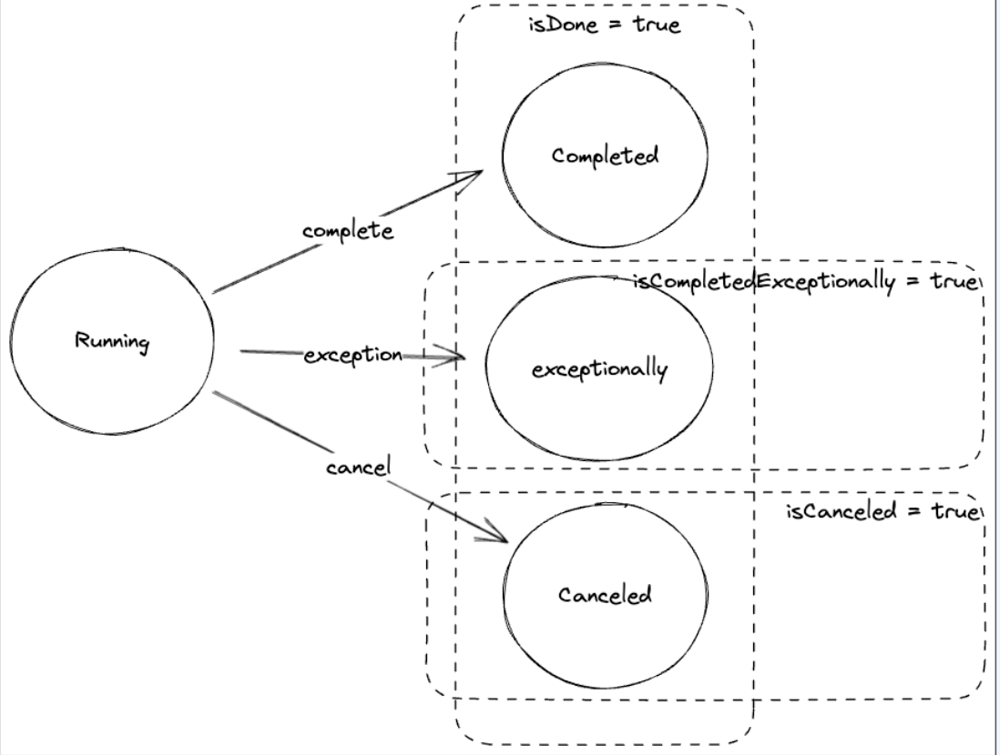

# CompletableFuture

~~~java
public class CompletableFuture<T> implements Future<T>, CompletionStage<T> {
    public static <U> CompletableFuture<U> supplyAsync(Supplier<U> supplier);
    public static CompletableFuture<Void> runAsync(Runnable runnable);
    
    public boolean complete(T value);
    public boolean isCompleteExceptionally();
    
    public static CompletableFuture<Void> allOf(CompletableFuture<?>... cfs);
    public static CompletableFuture<Object> anyOf(CompletableFuture<?>... cfs);
}
~~~

## CompletableFuture : supplyAsync

* Supplier를 제공하여 CompletableFuture를 생성 가능
* Supplier의 반환값이 CompletableFuture의 결과로 반환한다.

~~~java
@FunctionalInterface
public interface Supplier<T> {
    T get();
}
public class CompletableFuture<T> implements Future<T>, CompletionStage<T> {
    public static <U> CompletableFuture<U> supplyAsync(Supplier<U> supplier);
}
~~~

~~~java
public class CompletableFutureSupplyAsyncExample {
    public void supplyAsync() {
        var future = CompletableFuture.supplyAsync(() ->{
            try {
                Thread.sleep(100);
            } catch (InterruptedException e) {
                throw new RuntimeException(e);
            }
            return 1;
        });
        assert !future.isDone();
        
        Thread.sleep(1000);
        assert future.isDone();
        assert future.get() == 1;
    }
} 
~~~

## CompletableFuture : runAsync

* Runnable을 제공하여 CompletableFuture를 생성 가능
* 값을 반환하지 않는다.
* 다음 task에 null이 전달된다.

~~~java
@FunctionalInterface
public interface Runnable {
    public abstract void run();
}
public class CompletableFuture<T> implements Future<T>, CompletionStage<T> {
    public static CompletableFuture<Void> runAsync(Runnable runnable);
}
~~~

~~~java
public class CompletableFutureRunAsyncExample {
    public void runAsync() {
        var future = CompletableFuture.runAsync(() ->{
            try {
                Thread.sleep(100);
            } catch (InterruptedException e) {
                throw new RuntimeException(e);
            }
        });
        assert !future.isDone();
        
        Thread.sleep(1000);
        assert future.isDone();
        assert future.get() == null;
    }
}
~~~

## CompletableFuture : complete

* CompletableFuture가 완료되지 않았다면 주어진 값으로 채운다.
* complete에 의해서 상태가 바뀌었다면 true, 아니라면 false를 반환한다.

~~~java
public class CompletableFuture<T> implements Future<T>, CompletionStage<T> {
    public boolean complete(T value);
}
~~~

~~~java
public class CompletableFutureCompleteExample {
    public void complete() {
        var future = new CompletableFuture<Integer>();
        assert !future.isDone();
        
        var triggered = future.complete(1);
        assert future.isDone();
        assert triggered;
        assert future.get() == 1;
        
        triggered = future.complete(2);
        assert future.isDone();
        assert !triggered;
        assert future.get() == 1;
    }
}
~~~

## CompletableFuture의 상태

