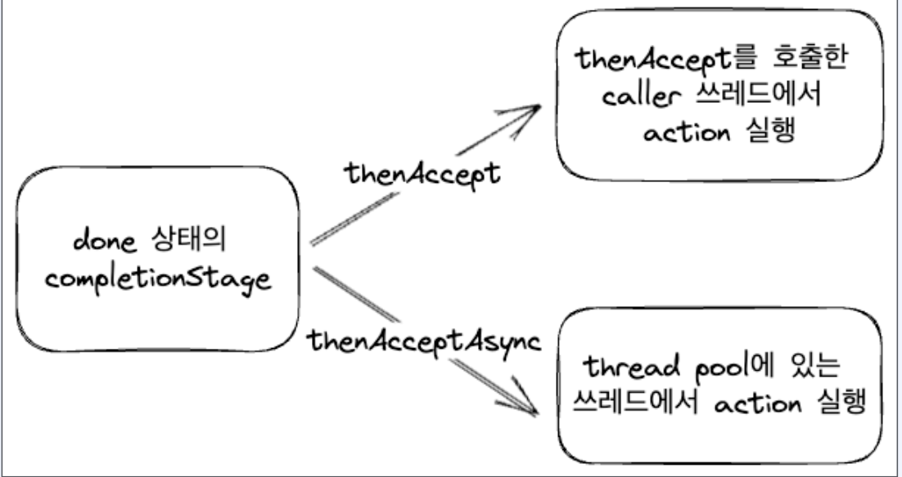
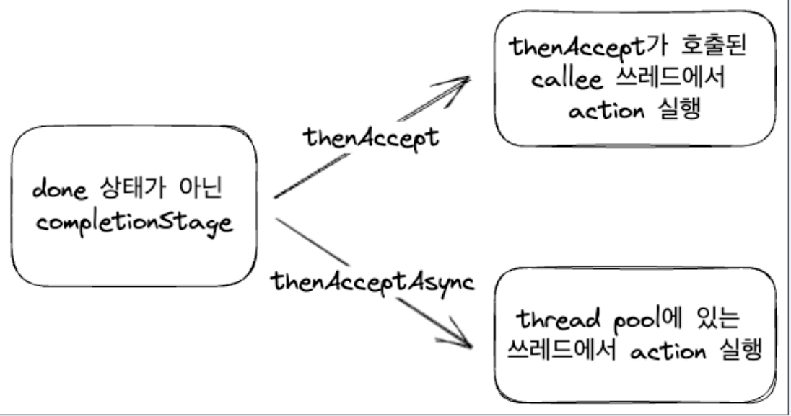
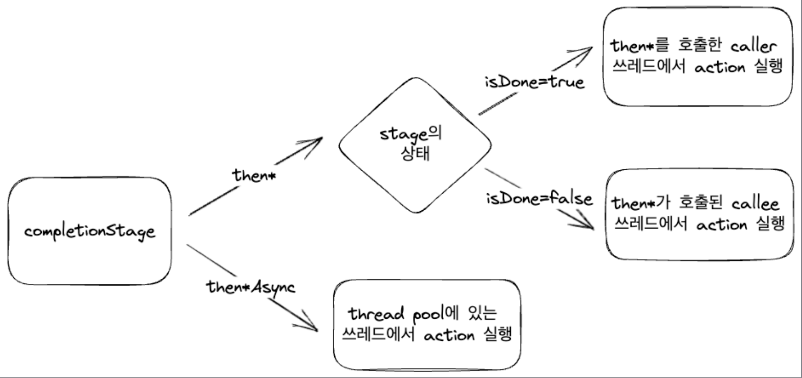

# CompletionStage : thenAccept[Async]

---

* Consumer를 파라미터로 받는다.
* 이전 task로부터 값을 받지만 값을 넘기지 않는다.
* 다음 task에게 null을 전달한다.
* 값을 받아서 action만 수행하는 경우 유용

~~~java
@FunctionalInterface
public interface Consumer<T> {
    void accept(T t);
}
public class CompletionStage{
  public CompletionStage<Void> thenAccept(Consumer<? super T> action);
  public CompletionStage<Void> thenAcceptAsync(Consumer<? super T> action);
}
~~~

## thenAccept Vs thenAcceptAsync (done 상태)

---

### thenAccept
* thenAccept : 이전 task와 동일한 스레드에서 실행
~~~java
public class CompletionStageThenAcceptExample {
    public static void thenAccept() {
        log.info("start main");
        CompletionStage<Integer> stage = Helper.finishedStage();
        stage.thenAccept(i -> {
            log.info("{} in thenAccept", i);
        }).thenAccept(i -> {
            log.info("{} in thenAccept2", i);
        });
        log.info("after thenAccept");
        Thread.sleep(100);
    }
}
~~~
~~~
[           main] c.s.c.CompletionStageThenAcceptExample   : start main
[onPool-worker-1] com.sim.completionstage.Helper           : supplyAsync
[           main] c.s.c.CompletionStageThenAcceptExample   : 1 in thenAccept
[           main] c.s.c.CompletionStageThenAcceptExample   : null in thenAccept2
[           main] c.s.c.CompletionStageThenAcceptExample   : after thenAccept
~~~

### thenAcceptAsync
* thenAcceptAsync : task가 ForkJoinPool의 다른 스레드에서 비동기로 실행
~~~java
public class CompletionStageThenAcceptExample {
    public static void thenAcceptAsync() {
        log.info("start main");
        CompletionStage<Integer> stage = Helper.finishedStage();
        stage.thenAcceptAsync(i -> {
            log.info("{} in thenAcceptAsync", i);
        }).thenAcceptAsync(i -> {
            log.info("{} in thenAcceptAsync2", i);
        });
        log.info("after thenAccept");
        Thread.sleep(100);
    }
}
~~~
~~~
[           main] c.s.c.CompletionStageThenAcceptExample   : start main
[onPool-worker-1] com.sim.completionstage.Helper           : supplyAsync
[onPool-worker-1] c.s.c.CompletionStageThenAcceptExample   : 1 in thenAcceptAsync
[           main] c.s.c.CompletionStageThenAcceptExample   : after thenAccept
[onPool-worker-1] c.s.c.CompletionStageThenAcceptExample   : null in thenAcceptAsync2
~~~

## thenAccept[Async]의 실행 스레드

---

* done 상태에서 thenAccept는 caller(main)의 스레드에서 실행
* done 상태의 completionStage에 thenAccept를 사용하는 경우, caller 스레드를 block 할 수 있다.

## thenAccept Vs thenAcceptAsync (done 상태가 아닌 경우)

---

### thenAccept

---

~~~java
public class CompletionStageThenAcceptRunningExample {
    public static void thenAccept() {
        log.info("start main");
        CompletionStage<Integer> stage = Helper.runningStage();
        stage.thenAccept(i ->{
            log.info("{} in thenAccept", i);
        }).thenAccept(i ->{
            log.info("{} in thenAccept2", i);
        });
        Thread.sleep(2000);
    }
}
~~~
~~~
[           main] .CompletionStageThenAcceptRunningExample : start main
[onPool-worker-1] com.sim.completionstage.Helper           : I'm running!
[onPool-worker-1] .CompletionStageThenAcceptRunningExample : 1 in thenAccept
[onPool-worker-1] .CompletionStageThenAcceptRunningExample : null in thenAccept2
~~~

### thenAcceptAsync

---

~~~java
public class CompletionStageThenAcceptRunningExample {
    public static void thenAcceptAsync() {
        log.info("start main");
        CompletionStage<Integer> stage = Helper.runningStage();
        stage.thenAcceptAsync(i ->{
            log.info("{} in thenAcceptAsync", i);
        }).thenAcceptAsync(i ->{
            log.info("{} in thenAcceptAsync", i);
        });
        Thread.sleep(2000);
    }
}
~~~
~~~
[           main] .CompletionStageThenAcceptRunningExample : start main
[onPool-worker-1] com.sim.completionstage.Helper           : I'm running!
[onPool-worker-2] .CompletionStageThenAcceptRunningExample : 1 in thenAcceptAsync
[onPool-worker-2] .CompletionStageThenAcceptRunningExample : null in thenAcceptAsync
~~~

## thenAccept[Async]의 실행 스레드

---

* done 상태가 아닌 thenAccept는 calle의 스레드에서 실행
* done 상태가 아닌 completionStage에 thenAccept를 사용하는 경우, caller 스레드를 block 할 수 있다.
  

## then*[Async]의 실행 스레드

---

## then*Async의 스레드풀 변경

---

* 모든 then*Async 연산자는 executor를 추가 인자로 받는다.
* 이를 통해서 다른 스레드풀로 task를 실행할 수 있다.

~~~java
public class CompletionStageThenAcceptAsyncExecutorExample {
    public static void thenAsync() {
        var single = Executors.newSingleThreadExecutor();
        var fixed = Executors.newFixedThreadPool(10);
        log.info("start main");
        CompletionStage<Integer> stage = Helper.completionStage();
        stage.thenAcceptAsync(i -> {
            log.info("{} in thenAcceptAsync", i);
        }, fixed).thenAcceptAsync(i -> {
            log.info("{} in thenAcceptAsync2", i);
        }, single);
        log.info("after thenAccept");
        Thread.sleep(200);
        single.shutdown();
        fixed.shutdown();
    }
}
~~~
~~~

[           main] etionStageThenAcceptAsyncExecutorExample : start main
[onPool-worker-1] com.sim.completionstage.Helper           : return in future
[           main] etionStageThenAcceptAsyncExecutorExample : after thenAccept
[pool-3-thread-1] etionStageThenAcceptAsyncExecutorExample : 1 in thenAcceptAsync
[pool-2-thread-1] etionStageThenAcceptAsyncExecutorExample : null in thenAcceptAsync2
~~~