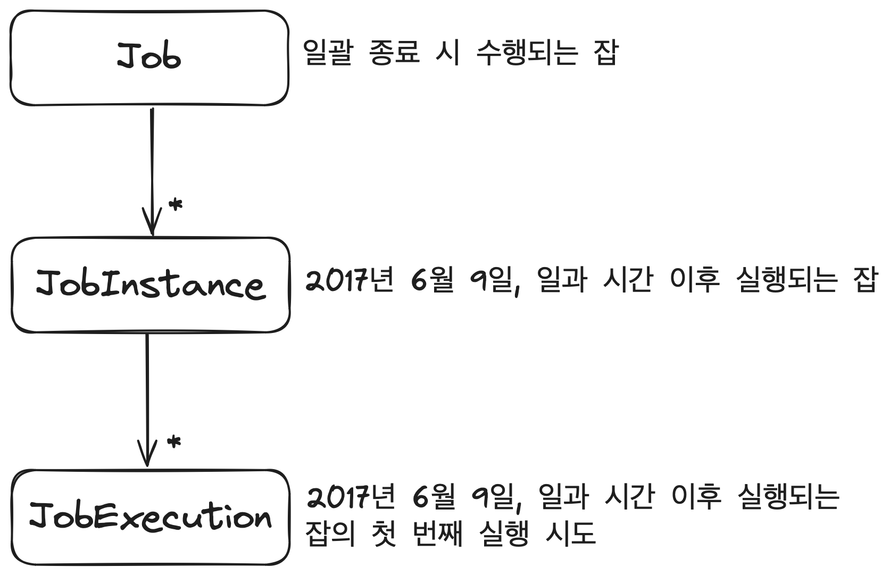
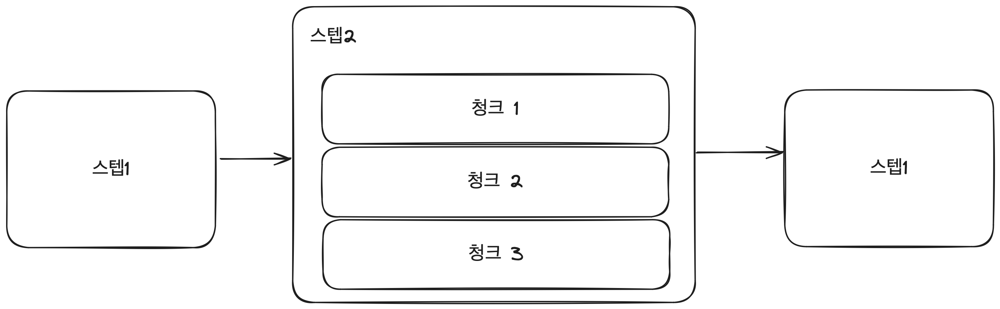
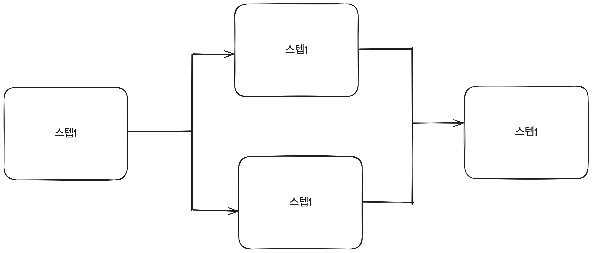
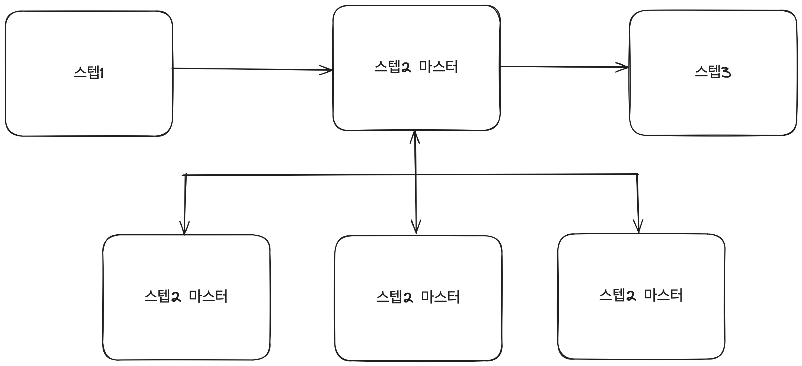

# 배치 아키텍처

## 잡과 스텝

* 스템에는 태스크릿(tasklet)기반 스텝과 청크(chunk)기반 스텝이 있습니다.
* 태스크릿 기반 스텝을 사용하고 싶으면 Tasklet을 구현하면 됩니다. 스텡비 중지될 때까지 execute 메소드가 계속 반복 수행됩니다.
* 태스크릿 기반 스텝은 초기화, 저장 프로시저 실행, 알림 전송 등과 같은 잡에서 일반적으로 사용됩니다.
* 청크 기반 스텝은 아이템 기반의 처리에 사용됩니다.
* 청크 기반 스텝은 ItemReader, ItemProcessor, ItemWriter로 구성될 수 있습니다.
* 스프링 잡 구조화 방법을 통해 각 스텝이 서로 독립적으로 처리될 수 있습니다.
* 스텝은 자신에게 필요한 데이터를 가져와 필요한 업무 로직을 수행하고 적절한 위치에 데이터를 기록합니다.
* 스텝을 분리함으로써 다음과 같은 기능을 제공합니다.
  * 유연성 : 개발자가 재사용이 가능하게 구성할 수 있도록 여러 빌더를 제공합니다.
  * 유지 보수성 : 각 스텝의 코드는 이전 스텝이나 다음 스텝과 독립적이므로 다른 스텝에 거의 영향을 미치지 않으면서 쉽게 각 스텝의 단위 테스트, 디버그, 변경을 할 수 있습니다.
이런 구조를 통해 스텝은 여러 잡에서 재사용될 수 있습니다.
  * 확장성 : 잡 내에 존재하는 독립적인 스텝은 확장 가능한 다양한 방법을 제공합니다.
  * 신뢰성 : 스프링 배치는 스텝의 여러 단계에 적용할 수 있는 강력한 오류 처리 방법을 제공합니다. 예외 발생 시 해당 아이템의 처리를 재시도하거나 건너뛰기 하는 등 동작을 수행할 수 있습니다.

## 잡 실행

* 잡을 실행하면 해당 잡은 각 스텝을 실행합니다. 각 스텝이 실행되면 JobRepository는 현재 상태로 갱신됩니다.
  즉, 실행된 스텝, 현재 상태, 읽은 아이템 및 처리된 아이템 수 등이 모두 JobRepository에 저장됩니다.
* 

### JobRepository

* JobRepository 컴포넌트는 다양한 배치 수행과 관련된 수치 데이터뿐만 아니라 잡의 상태를 유지 관리합니다.
* JobRepository는 일반적으로 관계형 데이터베이스를 사용하며 스프링 배치 내의 대부분의 주요 컴포넌트가 공유합니다.

### JobLauncher

* JobLauncher는 잡을 실행하는 역할을 담당합니다.
* JobLauncher는 Job.execute 메소드를 호출하는 역할 외에도, 잡의 재실행 가능 여부 검증, 잡의 실행 방법, 파라미터 유효성 검증 등의 처리를 수행합니다.

### JobExecution, StepExecution

* JobInstance는 스프링 배치 잡의 논리적인 실행(Logical Execution)입니다.
* JobInstance는 '잡의 이름'과 '잡의 논리적 실행을 위해 제공되는 고유한 식별 파라미터 모음'으로써 유일하게 존재합니다.
* JobExecution은 스프링 배치 잡의 실제 싱행을 의미합니다.
* 잡을 구동할 때마다 매번 새로운 JobExecution을 얻게 됩니다. 어쩔 때는 새로운 JobInstance를 얻지 못할 수 있습니다.
* StepExecution은 스텝의 실제 실행을 나타냅니다. 반면 StepInstance라는 개념은 존재하지 않습니다. 일반적으로 JobExecution은 여러 개의 StepExecution과 연관 됩니다.

## 병렬화

* 스프링 배치에서는 다양한 병렬화 방법을 제공합니다.
* 잡을 병렬화하는 방법에는 다중 스레드 스텝을 통한 작업 분할, 전체 스텝의 병렬 실행, 비동기 ItemProcessor/ItemWriter 구성, 원격 청킹, 파티셔닝이 있습니다.

### 다중 스레드 스텝

* 병렬화하는 첫 번째 방법은 다중 스레드 스텝을 이용해 잡을 나누는 것입니다.
* 잡은 청크(chunk)라는 블록 단위로 처리되도록 구성되며, 각 청크는 각자 독립적인 트랜잭션으로 처리됩니다. 일반적으로 각 청크는 연속해서 처리됩니다.

### 병렬 스텝

* 병렬화하는 두 번째 방법은 스텝을 병렬로 실행하는 것입니다.
* 예를 들면 다음과 같습니다.
  * 입력 파일의 데이터를 읽어오는 한 개의 스텝과 데이터베이스에 저장하는 한 개의 스텝이 있다고하면, 이 두 스텝은 독립적으로 실행될 수 있습니다.

### 비동기 ItemProcessor/ItemWriter

* ItemProcessor에 병목현상이 발생할 경우 일부 스텝을 병렬화하면 성능을 향상시킬 수 있습니다.
* SynchronousItemProcessor는 ItemProcessor가 호출할 때마다 동일한 스레드에서 실행하게 만들어주는, ItemProcessor 구현체의 데코레이터입니다.
* AsynchronousItemProcessor는 ItemProcessor 호출 결과를 반환하는 대신, 각 호출에 대해 Future를 반환합니다. 
현재 청크 내에서 반환된 Future 목록은 AsynchronousItemWriter로 전달됩니다.
* AsynchronousItemWriter는 스텝 내에서 실제로 사용해야하는 ItemWriter의 데코레이터로, Future를 이용해 실제 결과를 얻어낸 후 이를 위임 ItemWriter에 전달합니다.

### 원격 청킹

* 원격 청킹을 통해 단일 JVM 애플리케이션이 아닌 여러 JVM 애플리케이션에서 청킹을 수행할 수 있습니다.
* 원격 처리 방식으로는 원격 청킹이 있습니다.
  * 원격 청킹은 마스터 노드에서 표준 ItemReader를 사용해 이뤄집니다.
  * 다음 입력은 지속 가능한 통신 방식(메시지 큐)을 통해 메시지 기반 POJO로 구성된 원격 워커 ItemProcessor로 전송됩니다.
  * 처리가 완료되면 워커는 업데이트된 아이템을 다시 마스터로 보내거나 직접 기록합니다.
* 원격 청킹 방식은 마스터에서 데이터를 읽고 원격 워커에서 처리한 다음 다시 마스터에게 전송하므로, 네트워크 사용량이 매우 많아질 수 있다는 점에 유의해야 합니다.

### 파티셔닝

* 파티셔닝의 종류로 원격 파티셔닝(마스터 및 원격 워커를 사용) 및 로컬 파티셔닝(워커의 스레드 사용)가 있습니다.
* 원격 파티셔닝과 원격 청킹의 차이로는 원격 파티셔닝을 사용하면 내구성 있는 통신 방법이 필요하지 않으며 마스터는 워커의 스텝 수집을 위한 컨트롤러 역할만 수행합니다.
* 마스터가 워커의 스텝 수집을 위한 컨트롤러 역할만 경우 각 워커의 스텝은 독립적으로 동작하며 마치 로컬로 배포된 것처럼 동일하게 구성됩니다. 
유일한 차이로는 워커의 스텝이 자신의 잡 대신 마스터 노드로부터 일을 전달받는다는 점입니다.
* 모든 워커가 각각 맡은 일을 완료하면 마스터 스텝이 완료된 것으로 간주합니다.
* JobRepository가 분산된 작업의 상태를 알지 못하는 원격 청킹 방식과 다르게, JobRepository가 복제한 작업이 없고 모든 작업이 완료됐음을 보장하기 때문에 내구성 있는 지속적인 통신이 필요없습니다.