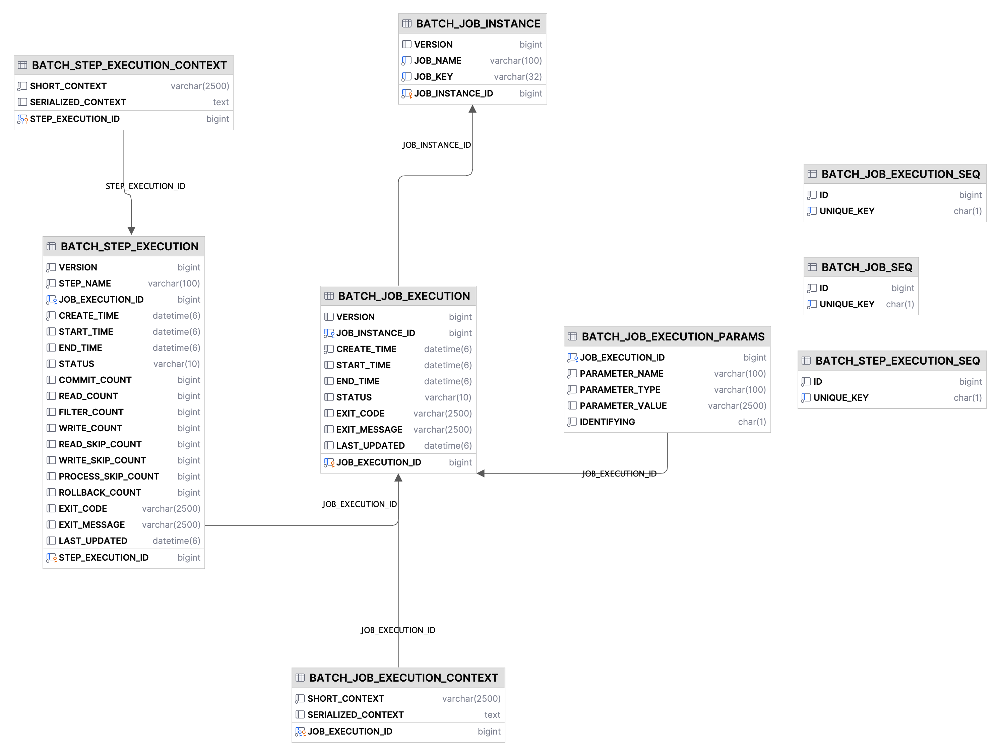

# JobRepository

* 스프링 배치 내에서 JobRepository는 두 가지 의미를 나타냅니다.
  * JobRepository 인터페이스
  * JobRepository 인터페이스를 구현해 데이터를 저장하는 데 사용되는 데이터 저장소
* 스프링 배치에서 JobRepository를 이용해 데이터를 저장하는 저장소로는 인메모리와 관계형 데이터베이스를 이용합니다.

## 관계형 데이터베이스

* 관계형 데이터베이스는 스프링 배치에서 기본적으로 사용되는 JobRepository 입니다.
* 관계형 데이터베이스 방식은 스프링 배치가 제공하는 여러 데이터베이스 테이블을 사용해 배치 메타데이터를 저장합니다.

* 스프링 배치는 다음과 같은 테이블을 사용합니다.
  * BATCH_JOB_EXECUTION
  * BATCH_JOB_EXECUTION_CONTEXT
  * BATCH_JOB_EXECUTION_PARAMS
  * BATCH_JOB_EXECUTION_SEQ
  * BATCH_JOB_INSTANCE
  * BATCH_JOB_SEQ
  * BATCH_STEP_EXECUTION
  * BATCH_STEP_EXECUTION_CONTEXT
  * BATCH_STEP_EXECUTION_SEQ

### BATCH_JOB_INSTANCE

* 스키마의 실제 시작점은 BATCH_JOB_INSTANCE 입니다.
* BATCH_JOB_INSTANCE 상세 구조는 다음과 같습니다.

| 필드               | 설명                                                    |
|------------------|-------------------------------------------------------|
| JOB-EXECUTION_ID | 테이블의 기본 키                                             |
| VERSION          | 낙관적인 락에 사용되는 레코드 버전                                   |
| JOB_NAME         | 실행된 잡의 이름                                             |
| JOB_KEY          | 잡 이름과 잡 파라미터의 해시 값으로, JobInstance를 고유하게 식별하는 데 사용되는 값 |

### BATCH_JOB_EXECUTION

* BATCH_JOB_EXECUTION 테이블은 배치 잡의 실제 실행 기록을 나타냅니다.
* 잡이 실행 될 때마다 새 레코드가 해당 테이블에 생성되고, 잡이 진행되는 동안 주기적으로 업데이트됩니다.
* BATCH_JOB_EXECUTION와 연관이 있는 세 개의 테이블이 존재합니다.
  * BATCH_JOB_EXECUTION_CONTEXT
  * BATCH_JOB_EXECUTION_PARAMS
  * BATCH_STEP_EXECUTION
* BATCH_JOB_EXECUTION 상세 구조는 다음과 같습니다.

| 필드               | 설명                                |
|------------------|-----------------------------------|
| JOB_EXECUTION_ID | 테이블의 기본 키                         |
| VERSION          | 낙관적인 락에 사용되는 레코드의 버전              |
| JOB_INSTANCE_ID  | BATCH_JOB_INSTACNE 테이블을 참조하는 외래 키 |
| CREATE_TIME      | 레코드가 생성된 시간                       |
| START_TIME       | 잡 실행이 시작된 시간                      |
| END_TIME         | 잡 실행이 완료된 시간                      |
| STATUS           | 잡 실행의 배치 상태                       |
| EXIT_CODE        | 잡 실행의 종료 코드                       |
| EXIT_MESSAGE     | EXIT_CODE와 관련된 메시지나 스택 트레이스       |
| LAST_UPDATED     | 레코드가 마지막으로 갱신된 시간                 |

### BATCH_JOB_EXECUTION_CONTEXT

* BATCH_JOB_EXECUTION_CONTEXT는 배치 실행에 있어 상태를 저장하는 ExecutionContext의 정보를 보관하는 테이블입니다.
* ExecutionContext를 직렬화하는 방법은 다음과 같습니다.
  * 스프링 배치 4버전 이전에는 XStream의 JSON 처리 기능의 사용을 선호해 이를 기본 프레임워크로 사용
  * 스프링 배치 4 이후 Jackson2를 기본적으로 사용
* BATCH_JOB_EXECUTION_CONTEXT의 테이블 세부 정보는 다음과 같습니다.

| 필드                 | 설명                                 |
|--------------------|------------------------------------|
| JOB_EXECUTION_ID   | 테이블의 기본 키                          |
| SHORT_CONTEXT      | 트림 처리된(trimmed) SERIALIZED_CONTEXT |
| SERIALIZED_CONTEXT | 직렬화된 ExecutionContext              |

### BATCH_JOB_EXECUTION_PARAMS

* BATCH_JOB_EXECUTION_PARAMS 테이블은 잡이 매번 실행될 때마다 사용된 잡 파라미터를 저장합니다.
* 잡이 재시작하면 잡의 식별 정보 파라미터만 자동으로 전달됩니다.
* BATCH_JOB_EXECUTION_PARAMS의 테이블 세부 정보는 다음과 같습니다.

| 필드               | 설명                       |
|------------------|--------------------------|
| JOB_EXECUTION_ID | 테이블의 기본 키                |
| TYPE_CODE        | 파라미터 값의 타입을 나타내는 문자열     |
| KEY_NAME         | 파라미터의 이름                 |
| STRING_VAL       | 타입이 String인 경우 파라미터의 값   |
| DATE_VAL         | 타입이 Date인 경우 파라미터의 값     |
| LONG_VAL         | 타입이 Long인 경우 파라미터의 값     |
| DOUBLE_VAL       | 타입이 Double인 경우 파라미터의 값   |
| IDENTIFYING      | 파라미터가 식별되는지 여부를 나타내는 플래그 |

### BATCH_STEP_EXECUTION

* 스프링 배치에서 잡의 메타데이터 정의에 사용되는 테이블 이외에 스텝의 메타데이터를 저장하는 테이블이 존재합니다. 이 종류로는 BATCH_STEP_EXECUTION와 BATCH_STEP_EXECUTION_CONTEXT가 있습니다.
* BATCH_STEP_EXECUTION 테이블에는 스텝의 시작, 완료, 상태에 대한 메타데이터를 저장합니다. 또한 스텝 분석이 가능하도록 다양한 횟수 값을 추가로 저장합니다.
* BATCH_STEP_EXECUTION 테이블에는 읽기 횟수, 처리 횟수, 쓰기 횟수, 건너뛰기 횟수 등과 같은 모든 데이터가 저장됩니다.
* BATCH_STEP_EXECUTION의 테이블 세부 정보는 다음과 같습니다.

| 필드                 | 설명                                     |
|--------------------|----------------------------------------|
| STEP_EXECUTION_ID  | 테이블의 기본 키                              |
| VERSION            | 낙관적인 락에 사용되는 레코드의 버전                   |
| STEP_NAME          | 스템의 이름                                 |
| JOB_EXECUTION_ID   | BATCH_JOB_EXECUTION 테이블을 참조하는 외래 키     |
| START_TIME         | 스텝 실행이 시작된 시간                          |
| END_TIME           | 스텝 실행이 완료된 시간                          |
| STATUS             | 스텝의 배치 상태                              |
| COMMIT_COUNT       | 스텝 실행 중에 커밋된 트랜잭션 수                    |
| READ_COUNT         | 읽은 아이템 수                               |
| FILTER_COUNT       | 아이템 프로세서가 null을 반환해 필터링된 아이템 수         |
| WRITE_COUNT        | 기록된 아이템 수                              |
| READ_SKIP_COUNT    | ItemReader 내에서 예외가 던져졌을 때 건너뛴 아이템 수    |
| PROCESS_SKIP_COUNT | ItemProcessor 내에서 예외가 던져졌을 때 건너뛴 아이템 수 |
| WRITE_SKIP_COUNT   | ItemWrite 내에서 예외가 던져졌을 때 건너뛴 아이템 수     |
| ROLLBACK_COUNT     | 스텝 실행에서 롤백된 트랜잭션 수                     |
| EXIT_CODE          | 스텝의 종료 코드                              |
| EXIT_MESSAGE       | 스텝 실행에서 반환된 메시지나 스택 트레이스               |
| LAST_UPDATED       | 레코드가 마지막으로 업데이트된 시간                    |

### BATCH_STEP_EXECUTION_CONTEXT

* BATCH_STEP_EXECUTION_CONTEXT는 StepExecution의 ExecutionContext의 상태를 저장하는데 사용됩니다.
* BATCH_STEP_EXECUTION_CONTEXT의 테이블 세부 정보는 다음과 같습니다.

| 필드                 | 설명                        |
|--------------------|---------------------------|
| STEP_EXECUTION_ID  | 테이블의 기본 키                 |
| SHORT_CONTEXT      | 트림 처리된 SERIALIZED_CONTEXT |
| SERIALIZED_CONTEXT | 직렬화된 ExectionContext      |

## 인메모리 JobRepository

* 스프링 배치 잡을 개발하거나 단위 테스트를 진행할 때, 외부 데이터베이스를 구성하는 작업이 실제로 얻는 이익보다 더 많은 문제가 발생할 수 있기에 스프링에서는 Map을 이용한 JobRepository 구현체를 제공합니다.