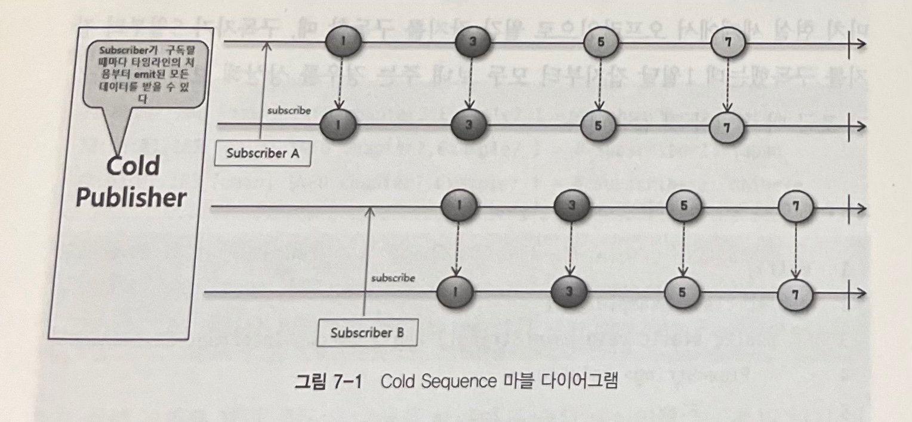
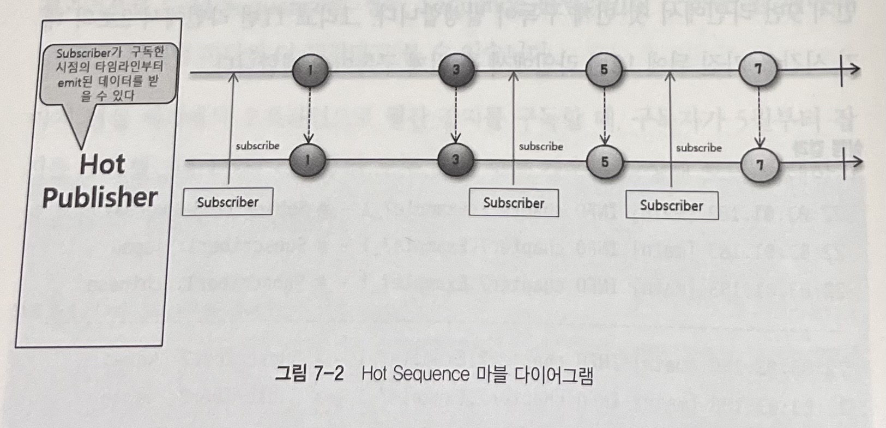

# Cold Sequence & Hot Sequence

## Cold & Hot

컴퓨터 시스템에서의 Cold와 Hot은 다음과 같은 의미로 사용됩니다.
* Cold : 무언가를 새로 시작
* Hot : 무언가를 새로 시작하지 않음

## Cold Sequence

Cold는 무언가를 새로 시작하는 것이라고 설명했는데, 이를 Sequence에 적용해보면 Cold Sequence는 Sequence가 새로 시작한다라고 생각해 볼 수 있습니다.

Cold Sequence는 Subscriber가 구독할 때마다 데이터 흐름이 처음부터 다시 시작되는 Sequence입니다.

Cold Sequence를 마블다이어그램으로 표현한것입니다.

위 마블다이어그램을 확인해보면 두개의 타임라인이 존재하는데 각 타임라인에는 SubscriberA와 SubscriberB 그리고 두 타임라인의 구독시점이 다른것을 알 수 있습니다. 하지만 Cold Sequence는 매 구독마다 데이터 흐름이 처음부터 다시 시작되기 때문에 각 구독에 대해서 같은 데이터를 emit함을 알 수 있습니다. 이러한 흐름을 동작하는 Publisher를 Cold Publisher라고 합니다.

### Cold Sequence 코드 예제

~~~java
public class ColdSequenceExample{
    public static void main(String[] args) {
        Flux<String> coldFlux = 
                Flux.fromIterable(Arrays.asList("KOREA", "JAPAN", "CHINESE"))
                        .map(String::toLowerCase);
        
        coldFlux.subscribe(county -> log.info("# Subscriber1: {}", county));
        System.out.println("------------------------------");
        coldFlux.subscribe(county -> log.info("# Subscriber2: {}", county));
    }
}
~~~
~~~
35:51 [main] - # Subscriber1: korea
35:51 [main] - # Subscriber1: japan
35:51 [main] - # Subscriber1: chinese
----------------------------------------
35:51 [main] - # Subscriber2: korea
35:51 [main] - # Subscriber2: japan
35:51 [main] - # Subscriber2: chinese
~~~

## Hot Sequence

Hot은 무언가를 새로 시작하지 않는 것을 의미합니다. 이를 Sequence에 적용해보면 Hot Sequence는 Sequence가 새로 시작하지 않는다고 생각해 볼 수 있습니다.

Hot Sequence는 Subscriber가 구독하면 Publisher가 이전에 emit한 데이터는 전달받지 못하고 구독이 발생한 시점 이후로 emit한 데이터만 받을 수 있습니다.

Hot Sequence을 마블다이어그램으로 표현한 것입니다.

Hot Sequence는 Cold Sequence와는 다르게 여러 Subscriber가 구독을 하였지만 타임라인이 하나만 생성됨을 알 수 있습니다.

또한 각 Subscriber에 대해서 다음과 같은 데이터를 전달 받을 수 있습니다.
* Subscriber A : 1,3,5,7 수신
* Subscriber B : 5,7 수신
* Subscriber C : 7 수신

### Hot Sequence 예제 코드

~~~java
public class HotSequenceExample{
    public static void main(String[] args) {
        String[] singers = {"Singer A","Singer B","Singer C","Singer D","Singer E"};

        log.info("# Begin concert:");

        Flux<String> concertFlux = Flux.fromArray(singers)
                .delayElements(Duration.ofSeconds(1))
                .share(); // Hot Sequence 생성

        concertFlux.subscribe(singer -> log.info("# Subscriber1 is watching {}'s song", singer));

        Thread.sleep(2500);

        concertFlux.subscribe(singer -> log.info("# Subscriber2 is watching {}'s song", singer));

        Thread.sleep(3000);
    }
}
~~~
~~~
47:46 [main] - # Begin concert:
47:47 [parallel-2] - # Subscriber1 is watching Singer A's song
47:48 [parallel-3] - # Subscriber1 is watching Singer B's song
47:49 [parallel-4] - # Subscriber1 is watching Singer C's song
47:49 [parallel-4] - # Subscriber2 is watching Singer C's song
47:50 [parallel-5] - # Subscriber1 is watching Singer D's song
47:50 [parallel-5] - # Subscriber2 is watching Singer D's song
47:51 [parallel-6] - # Subscriber1 is watching Singer E's song
47:51 [parallel-6] - # Subscriber2 is watching Singer E's song
~~~

## Cold Sequence -> Hot Sequence 변환 Operator

Reactor에는 Cold Sequence를 Hot Sequence로 동작을 변화시킬 수 있는 Operator가 존재합니다.

대표적인 예로는 share(), cache()가 있습니다.

### share()

share 메소드는 원본 Flux를 공유하는 새로운 Flux를 반환합니다. 따라서 원본 Flux가 데이터를 emit하고 있는 중간에 구독을 하게된다면 해당 Subscriber는 새로운 Flux를 통해 구독 이후에 emit되는 데이터를 전달 받을 수 있습니다. 

>Returns a new Flux that multicasts (shares) the original Flux. As long as there is at least one Subscriber this Flux will be subscribed and emitting data. When all subscribers have cancelled it will cancel the source Flux.
> 
> This is an alias for publish().ConnectableFlux.refCount().
> 
> Returns:
a Flux that upon first subscribe causes the source Flux to subscribe once, late subscribers might therefore miss items.

### share() 예제 코드

~~~java
public class HotSequenceExample{
    public static void main(String[] args) {
        String[] singers = {"Singer A","Singer B","Singer C","Singer D","Singer E"};

        log.info("# Begin concert:");

        Flux<String> concertFlux = Flux.fromArray(singers)
                .delayElements(Duration.ofSeconds(1))
                .share(); // Hot Sequence 생성

        concertFlux.subscribe(singer -> log.info("# Subscriber1 is watching {}'s song", singer));

        Thread.sleep(2500);

        concertFlux.subscribe(singer -> log.info("# Subscriber2 is watching {}'s song", singer));

        Thread.sleep(3000);
    }
}
~~~
~~~
47:46 [main] - # Begin concert:
47:47 [parallel-2] - # Subscriber1 is watching Singer A's song
47:48 [parallel-3] - # Subscriber1 is watching Singer B's song
47:49 [parallel-4] - # Subscriber1 is watching Singer C's song
47:49 [parallel-4] - # Subscriber2 is watching Singer C's song
47:50 [parallel-5] - # Subscriber1 is watching Singer D's song
47:50 [parallel-5] - # Subscriber2 is watching Singer D's song
47:51 [parallel-6] - # Subscriber1 is watching Singer E's song
47:51 [parallel-6] - # Subscriber2 is watching Singer E's song
~~~

### cache()

cache 메소드는 emit된 데이터를 캐싱하고 구독이 발생할 시 이전 캐싱된 데이터를 전달하고 이후에는 똑같이 emit한 데이터를 수신받을 수 있습니다.

> Turn this Flux into a hot source and cache last emitted signals for further Subscriber. Will retain an unbounded volume of onNext signals. Completion and Error will also be replayed.

### cache() 예제 코드

~~~java
public class HotSequenceExample{
    public static void main(String[] args) {
        String[] singers = {"Singer A","Singer B","Singer C","Singer D","Singer E"};

        log.info("# Begin concert:");

        Flux<String> concertFlux = Flux.fromArray(singers)
                .delayElements(Duration.ofSeconds(1))
                .cache(); // Hot Sequence 생성

        concertFlux.subscribe(singer -> log.info("# Subscriber1 is watching {}'s song", singer));

        Thread.sleep(2500);

        concertFlux.subscribe(singer -> log.info("# Subscriber2 is watching {}'s song", singer));

        Thread.sleep(3000);
    }
}
~~~
~~~
55:35 [main] - # Begin concert:
55:36 [parallel-2] - # Subscriber1 is watching Singer A's song
55:37 [parallel-3] - # Subscriber1 is watching Singer B's song
55:38 [main] - # Subscriber2 is watching Singer A's song // 캐싱 데이터
55:38 [main] - # Subscriber2 is watching Singer B's song // 캐싱 데이터
55:38 [parallel-4] - # Subscriber1 is watching Singer C's song
55:38 [parallel-4] - # Subscriber2 is watching Singer C's song
55:39 [parallel-5] - # Subscriber1 is watching Singer D's song
55:39 [parallel-5] - # Subscriber2 is watching Singer D's song
55:40 [parallel-6] - # Subscriber1 is watching Singer E's song
55:40 [parallel-6] - # Subscriber2 is watching Singer E's song
~~~