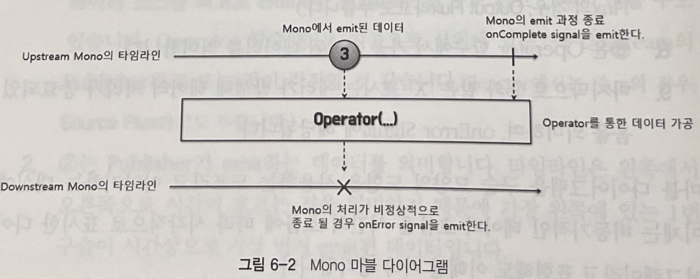

# Marble Diagram

## Marble Diagram 구성

1. 다이어그램에는 2개의 타임라인이 존재합니다. 그 중 첫번째가 1번과 같이 Publisher를 emit하는 라인입니다. 또한 5번의 Operator에 대한 Upstream으로도 볼 수 있습니다.
2. 2는 Publisher가 emit하는 데이터를 의미합니다. 타임라인은 왼쪽에서 오른쪽으로 흐르기 때문에 왼쪽에 있을수록 먼저 emit된 데이터입니다.
3. 3의 수직으로 된 바는 데이터의 emit이 정상적으로 종료됨을 의미합니다. 이는 onComplete Signal에 해당합니다.
4. 4와 같이 Operator 함수로 들어가는 점선 화살표는 Publisher로부터 emit된 데이터가 Operator 함수의 입력으로 전달되는 것을 의미합니다.
5. 5는 Publisher로부터 전달받은 데이터를 처리하는 Operator 함수입니다.
6. 6과 같이 Operator 함수에서 나가는 점선 화살표는 Publisher로부터 전달받은 데이터를 가공 처리할 후에 출력으로 내보내는 것을 의미합니다.
7. 7에서의 타임라인은 Operator 함수에서 가공 처리되어 출력으로 내보내진 데이터의 타임라인입니다.
8. 8은 Operator 함수에서 가공 처리된 데이터를 의미합니다.
9. 마지막으로 9화 같은 'X' 표시는 에러가 발생해 데이터 처리가 종료되었음을 의미합니다. onError Signal에 해당합니다.

## Marble Diagram으로 Reactor의 Publisher 이해하기

### Mono

위 그림은 Mono의 Marble Diagram입니다.

Mono는 0개또는 1개의 데이터를 emit하는 Publisher입니다.

~~~java
public class MonoExample{
    public static void main(String[] args) {
        Mono.just("Hello Reactor")
                .subscribe(System.out::println);
    }
}
~~~

위 코드는 Mono의 .just(...)을 사용하여 데이터를 emit하고 출력하는 예제입니다.

### Flux

위 그림은 Flux의 Marble Diagram입니다. Mono와는 다르게 여러개의 데이터의 emit을 볼 수 있습니다.

Flux는 0개 이상의 데이터를 emit하는 Publisher입니다.

~~~java
public class FluxExample{
    public static void main(String[] args) {
        Flux.just(6,9,13)
                .map(num -> num%2)
                .subscribe(System.out::println);
    }
}
~~~

위 코드는 Flux의 .just(...)을 사용하여 여러 데이터를 emit하는 예제입니다.

