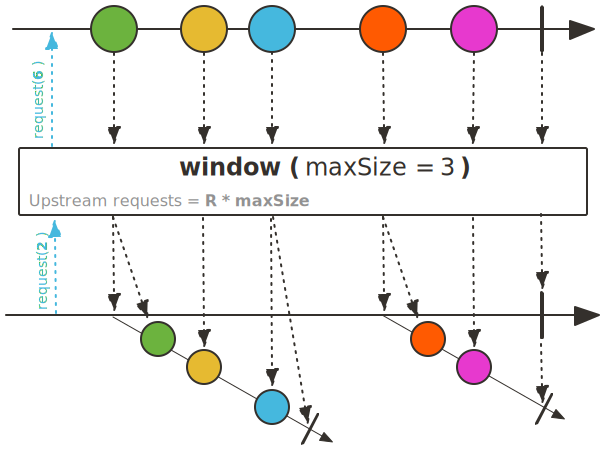
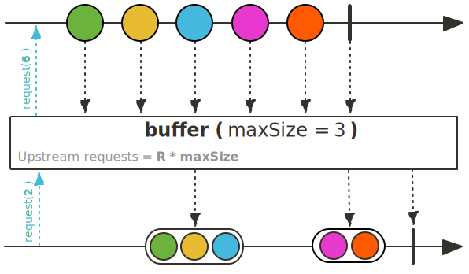
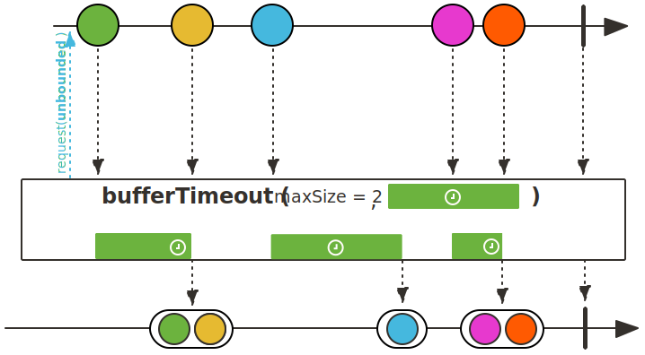
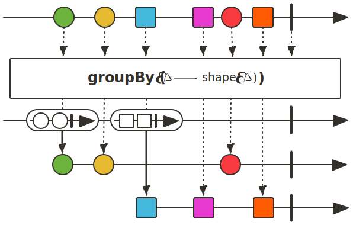
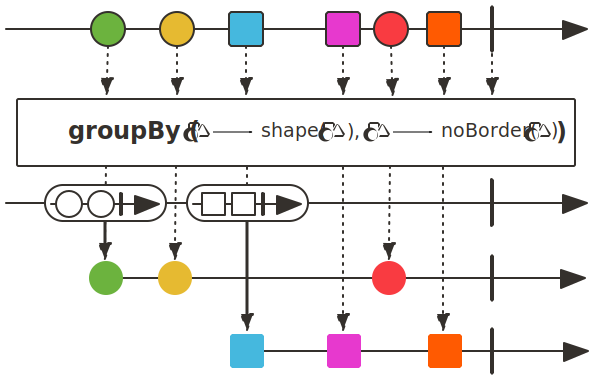

## Flux Sequence 분할을 위한 Operator

### window()

window(int maxSize) Operator는 Upstream에서 emit되는 첫 번째 데이터부터 maxSize 숫자만큼의 데이터를 포함하는 새로운 Flux로 분할합니다. 
Reactor에서는 이렇게 분할된 Flux를 윈도우라고 부릅니다.

~~~java
class WindowExample{
    public static void main(String[] args) {
        Flux.range(1,11) // Flux<Integer>
            .window(3) // Flux<Flux<Integer>>
            .flatMap(flux -> {
                log.info("====================");
                return flux;
            }) // Flux<Integer>
            .subscribe(new BaseSubscriber<Integer>() {
                @Override
                protected void hookOnSubscribe(Subscription subscription) {
                    subscription.request(2);
                }

                @Override
                protected void hookOnNext(Integer value) {
                    log.info("# onNext: {}",value);
                    request(2);
                }
            });
    }
}
~~~
~~~
21:21:29:27 [main] - ====================
21:21:29:27 [main] - # onNext: 1
21:21:29:27 [main] - # onNext: 2
21:21:29:27 [main] - # onNext: 3
21:21:29:27 [main] - ====================
21:21:29:27 [main] - # onNext: 4
21:21:29:27 [main] - # onNext: 5
21:21:29:27 [main] - # onNext: 6
21:21:29:27 [main] - ====================
21:21:29:27 [main] - # onNext: 7
21:21:29:27 [main] - # onNext: 8
21:21:29:27 [main] - # onNext: 9
21:21:29:27 [main] - ====================
21:21:29:27 [main] - # onNext: 10
21:21:29:27 [main] - # onNext: 11
~~~

### buffer()

buffer(int maxSize) Operator는 Upstream에서 emit되는 첫 번째 데이터부터 maxSize 숫자만큼의 데이터를 List 버퍼로 한 번에 emit합니다.

~~~java
class BufferExample{
    public static void main(String[] args) {
        Flux.range(1, 95)
            .buffer(10)
            .subscribe(buffer -> log.info("# onNext: {}",buffer));
    }
}
~~~
~~~
21:27:4:21 [main] - # onNext: [1, 2, 3, 4, 5, 6, 7, 8, 9, 10]
21:27:4:21 [main] - # onNext: [11, 12, 13, 14, 15, 16, 17, 18, 19, 20]
21:27:4:21 [main] - # onNext: [21, 22, 23, 24, 25, 26, 27, 28, 29, 30]
21:27:4:21 [main] - # onNext: [31, 32, 33, 34, 35, 36, 37, 38, 39, 40]
21:27:4:21 [main] - # onNext: [41, 42, 43, 44, 45, 46, 47, 48, 49, 50]
21:27:4:21 [main] - # onNext: [51, 52, 53, 54, 55, 56, 57, 58, 59, 60]
21:27:4:21 [main] - # onNext: [61, 62, 63, 64, 65, 66, 67, 68, 69, 70]
21:27:4:21 [main] - # onNext: [71, 72, 73, 74, 75, 76, 77, 78, 79, 80]
21:27:4:21 [main] - # onNext: [81, 82, 83, 84, 85, 86, 87, 88, 89, 90]
21:27:4:21 [main] - # onNext: [91, 92, 93, 94, 95]
~~~

### bufferTimeout()

bufferTimeout(maxSize, maxTime) Operator는 Upstream에서 emit되는 첫 번째 데이터부터 maxSize 숫자만큼의 데이터 또는 maxTime 내에 emit된 데이터를 List 버퍼로 한 번에 emit합니다.

또한 maxSize나 maxTime 중에서 먼저 조건에 부합할 때까지 emit된 데이터를 List 버퍼로 emit합니다.

~~~java
class BufferTimeoutExample{
    public static void main(String[] args) {
        Flux
            .range(1, 20)
            .map(num -> {
                try{
                    if(num < 10){
                        Thread.sleep(100L);
                    }else{
                        Thread.sleep(300L);
                    }
                } catch (InterruptedException e){}
                return num;
            })
            .bufferTimeout(3, Duration.ofMillis(400L))
            .subscribe(buffer -> log.info("# onNext: {}",buffer));
    }
}
~~~
~~~
21:35:15:28 [main] - # onNext: [1, 2, 3]
21:35:15:59 [main] - # onNext: [4, 5, 6]
21:35:15:89 [main] - # onNext: [7, 8, 9]
21:35:16:60 [parallel-1] - # onNext: [10, 11]
21:35:17:21 [parallel-1] - # onNext: [12, 13]
21:35:17:81 [parallel-1] - # onNext: [14, 15]
21:35:18:42 [parallel-1] - # onNext: [16, 17]
21:35:19:02 [parallel-1] - # onNext: [18, 19]
21:35:19:23 [main] - # onNext: [20]
~~~

### groupBy()

groupBy(keyMapper) Operator는 emit되는 데이터를 keyMapper로 생성한 key를 기준으로 그룹화한 GroupedFlux를 리턴하며, 이 GroupedFlux를 통해서 그룹별로 작업을 수행할 수 있습니다.

~~~java
class GroupByExample{
    public static void main(String[] args) {
        Flux
            .range(1, 20)
            .groupBy(num -> num%2==1)
            .flatMap(Flux::collectList)
            .subscribe(data -> log.info("# onNext: {}",data));
    }
}
~~~
~~~
21:42:37:47 [main] - # onNext: [2, 4, 6, 8, 10, 12, 14, 16, 18, 20]
21:42:37:47 [main] - # onNext: [1, 3, 5, 7, 9, 11, 13, 15, 17, 19]
~~~

groupBy(keyMapper, valueMapper) Operator는 그룹화하면서 valueMapper를 통해 그룹화되는 데이터를 다른 형태로 가공 처리할 수 있습니다.

~~~java
class GroupByExample{
    public static void main(String[] args) {
        Flux
            .range(1, 10)
            .groupBy(num -> num%2==1,
                num -> num+"( isEvenNumber: "+(num%2==0)+")")
            .flatMap(Flux::collectList)
            .subscribe(data -> log.info("# onNext: {}",data));
    }
}
~~~
~~~
21:47:23:05 [main] - # onNext: [2( isEvenNumber: true), 4( isEvenNumber: true), 6( isEvenNumber: true), 8( isEvenNumber: true), 10( isEvenNumber: true)]
21:47:23:05 [main] - # onNext: [1( isEvenNumber: false), 3( isEvenNumber: false), 5( isEvenNumber: false), 7( isEvenNumber: false), 9( isEvenNumber: false)]
~~~

> 참고 :
>
> 스프링으로 시작하는 리액티브 프로그래밍(https://product.kyobobook.co.kr/detail/S000201399476)