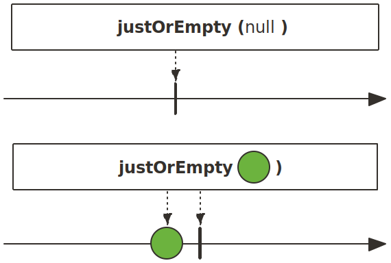
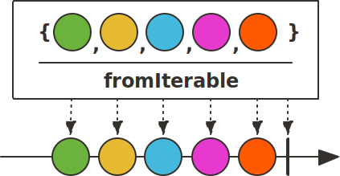
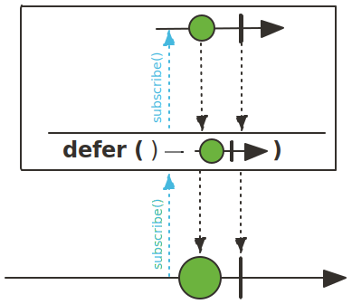
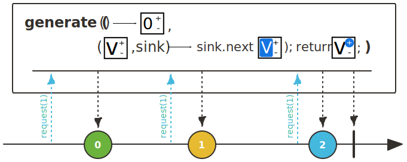

## Sequence  생성을 위한 Operator

### justOrEmpty()

justOrEmpty()는 just()의 확장 Operator로서, just() Operator와 달리, emit할 데이터가 null인경우 NullPointerException이 발생하지 않고 onComplete() Signal을 전송합니다.

~~~java
class JustOrEmptyExample {
    public static void main(String[] args) {
        Mono.justOrEmpty(null)
            .subscribe(data -> {},
                error -> {},
                () -> log.info("# onComplete"));
    }
}
~~~
~~~
28:55 [main] - # onComplete
~~~

### fromIterable()

 fromIterable() Operator는 Iterable에 포함된 데이터를 emit하는 Flux를 생성합니다. 즉, Java에서 제공하는 Iterable을 구현한 구현체를 fromIterable()의 파라미터로 전달할 수 있습니다.

~~~java
class FromIterableExample{
    public static void main(String[] args) {
        List<Tuple2<String, Integer>> coins = List.of(
            Tuples.of("Bitcoin", 10000),
            Tuples.of("Ethereum", 1000),
            Tuples.of("Ripple", 100),
            Tuples.of("Litecoin", 200)
        );

        Flux.fromIterable(coins)
            .subscribe(coin ->
                log.info("coin: {} - cost: {}", coin.getT1(), coin.getT2())
            );
    }
}
~~~
~~~
37:38 [main] - coin: Bitcoin - cost: 10000
37:38 [main] - coin: Ethereum - cost: 1000
37:38 [main] - coin: Ripple - cost: 100
37:38 [main] - coin: Litecoin - cost: 200
~~~

### fromStream()

 fromStream() Operator는 Stream에 포함된 데이터를 emit하는 Flux를 생성합니다. Java의 Stream 특성상 Stream은 재사용할 수 없으며 cancel, error, complete시에는 자동으로 닫히게 됩니다.

~~~java
class FromStreamExample{
    public static void main(String[] args) {
        List<Tuple2<String, Integer>> coins = List.of(
            Tuples.of("Bitcoin", 10000),
            Tuples.of("Ethereum", 1000),
            Tuples.of("Ripple", 100),
            Tuples.of("Litecoin", 200)
        );

        Flux.fromStream(() -> coins.stream())
            .filter(coin -> coin.getT1().equals("Bitcoin")|| coin.getT1().equals("Ethereum"))
            .subscribe(data -> log.info("{}",data));
    }
}
~~~
~~~
40:46 [main] - [Bitcoin,10000]
40:46 [main] - [Ethereum,1000]
~~~

### range()

range() Operator는 n부터 1씩 증가한 연속된 수를 m개 emit하는 Flux를 생성합니다.
range() Operator는 명령형 언어의 for문처럼 특정 횟수만큼 어떤 작업을 처리하고자 할 경우 주로 사용됩니다.

~~~java
class RangeExample{
    public static void main(String[] args) {
        Flux.range(5,10)
            .subscribe(data -> log.info("{}",data));
    }
}
~~~
~~~
43:53 [main] - 5
43:53 [main] - 6
43:53 [main] - 7
43:53 [main] - 8
43:53 [main] - 9
43:53 [main] - 10
43:53 [main] - 11
43:53 [main] - 12
43:53 [main] - 13
43:53 [main] - 14
~~~

### defer()

 defer() Operator는 Operator를 선언한 시점에 데이터를 emit하는 것이 아니라 구독하는 시점에 데이터를 emit하는 Flux 또는 Mono를 생성합니다. defer()는 데이터 emit을 지연시키기 때문에 꼭 필요한 시점에 데이터를 emit하여 불필요한 프로세스를 줄일 수 있습니다. 이는 switchIfEmpty() Operator에서 불필요하게 메서드가 호출되는것을 방지할때 유용하게 사용됩니다.

    
    

~~~java
class DeferExample{
    public static void main(String[] args) {
        log.info("# start: {}", LocalDateTime.now());
        Mono<LocalDateTime> justMono = Mono.just(LocalDateTime.now());
        Mono<LocalDateTime> deferMono = Mono.defer(() -> Mono.just(LocalDateTime.now()));

        Thread.sleep(2000);

        justMono.subscribe(d -> log.info("# justMono1: {}", d));
        deferMono.subscribe(d -> log.info("# deferMono1: {}", d));

        Thread.sleep(2000);

        justMono.subscribe(d -> log.info("# justMono2: {}", d));
        deferMono.subscribe(d -> log.info("# deferMono2: {}", d));
    }
}
~~~
~~~
53:22 [main] - # start: 2023-07-29T20:53:22.114473
53:24 [main] - # justMono1: 2023-07-29T20:53:22.116124 // just는 시간 동일
53:24 [main] - # deferMono1: 2023-07-29T20:53:24.146463 // defer는 구독 시점에 시간
53:26 [main] - # justMono2: 2023-07-29T20:53:22.116124 // just는 시간 동일
53:26 [main] - # deferMono2: 2023-07-29T20:53:26.154782 // defer는 구독 시점에 시간
~~~

### using()

using() Operator는 파라미터로 전달받은 resource를 emit하는 Flux를 생성합니다.

첫번쨰 파라미터는 읽어 올 resource이고, 두 번째 파라미터는 읽어 온 resource를 emit하는 Flux입니다. 마지막 세 번째 파라미터는 종료 Signal(onComplete, onError)이 발생할 경우, resource를 해제하는 등의 후처리를 할 수 있게 해줍니다.

~~~java
class UsingExample{
    public static void main(String[] args) {
        Path path = Path.of("/Users/simgyumin/Desktop/test.txt");

        Flux.using(() -> Files.lines(path), Flux::fromStream, Stream::close)
            .subscribe(log::info);
    }
}
~~~
~~~
07:52 [main] - Hello, world!
07:52 [main] - Nice to meet you!
07:52 [main] - Good Bye~!
~~~

### generate()-동기

generate() Operator는 프로그래밍 방식으로 Signal 이벤트를 발생시키며, 특히 동기적으로 데이터를 하나씩 순차적으로 emit하고자 할 경우 사용됩니다.

~~~java
class GenerateExample{
    public static void main(String[] args) {
        Flux.generate(() -> 0, (state, sink) -> {
                sink.next(state);
                if(state==10)
                    sink.complete();
                return ++state;
            })
            .subscribe(data -> log.info("# onNext: {}",data));
    }
}
~~~
~~~
12:37 [main] - # onNext: 0
12:37 [main] - # onNext: 1
12:37 [main] - # onNext: 2
12:37 [main] - # onNext: 3
12:37 [main] - # onNext: 4
12:37 [main] - # onNext: 5
12:37 [main] - # onNext: 6
12:37 [main] - # onNext: 7
12:37 [main] - # onNext: 8
12:37 [main] - # onNext: 9
12:37 [main] - # onNext: 10
~~~

### create()-비동기

 create() Operator는 generate() Operator처럼 프로그래밍 방식으로 Signal 이벤트를 발생시키지만 generate() Operator와 차이점이 존재합니다.

generate() Operator는 데이터를 동기적으로 한 번에 한 건씩 emit할 수 있는 반면에, create() Operator는 한 번에 여러 건의 데이터를 비동기적으로 emit할 수 있습니다.

~~~java
class CreateExample{
    static int SIZE =0;
    static int COUNT=-1;
    final static List<Integer> DATA_SOURCE = Arrays.asList(1,2,3,4,5,6,7,8,9,10);
    
    public static void main(String[] args) {
        log.info("# start");
        Flux.create((FluxSink<Integer> sink) -> {
            sink.onRequest(n -> {
                try{
                    Thread.sleep(1000L);
                    for(int i=0;i<n;i++){
                        if(COUNT>=9){
                            sink.complete();
                        }else{
                            COUNT++;
                            sink.next(DATA_SOURCE.get(COUNT));
                        }
                    }
                }catch (InterruptedException e){}
            });
            sink.onDispose(() -> log.info("# clean up"));
        }).subscribe(new BaseSubscriber<Integer>() {
            @Override
            protected void hookOnSubscribe(Subscription subscription) {
                request(2);
            }

            @Override
            protected void hookOnNext(Integer value) {
                SIZE++;
                log.info("# onNext: {}",value);
                if(SIZE ==2){
                    request(2);
                    SIZE=0;
                }
            }
        });

    }
}
~~~
~~~
22:22 [main] - # start
22:23 [main] - # onNext: 1
22:23 [main] - # onNext: 2
22:24 [main] - # onNext: 3
22:24 [main] - # onNext: 4
22:25 [main] - # onNext: 5
22:25 [main] - # onNext: 6
22:26 [main] - # onNext: 7
22:26 [main] - # onNext: 8
22:27 [main] - # onNext: 9
22:27 [main] - # onNext: 10
22:28 [main] - # clean up
~~~

> 참고 :
>
> 스프링으로 시작하는 리액티브 프로그래밍(https://product.kyobobook.co.kr/detail/S000201399476)