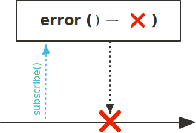
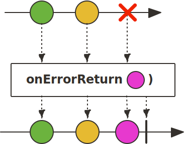
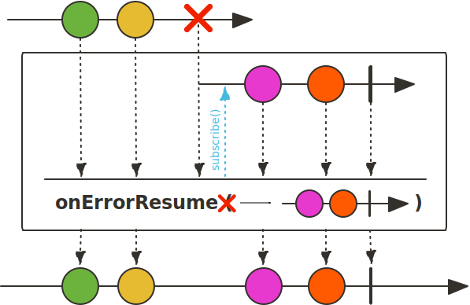
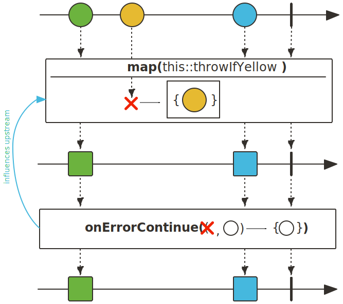
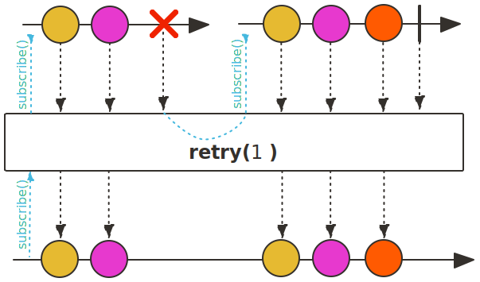

## 에러 처리를 위한 Operator

### error()

error() Operator는 파라미터로 지정된 에러로 종료하는 Flux를 생성합니다.

error() Operator는 마치 Java의 throw 키워드를 사용해서 예외를 의도적으로 던지는 것 같은 역할을 하는데 주로 체크 예외를 캐치해서 다시 던져야 하는 경우 사용할 수 있습니다.

~~~java
class ErrorExample{
    public static void main(String[] args) {
        Flux.range(1,5)
            .flatMap(num -> {
                if((num*2)%3==0){
                    return Flux.error(new IllegalArgumentException("Not allowed multiple of 3"));
                }else{
                    return Mono.just(num*2);
                }
            })
            .subscribe(data -> log.info("data : {}", data),
                error -> log.error("error : ", error),
                () -> log.info("complete"));
    }
}
~~~
~~~
20:09:29:38 [main] - data : 2
20:09:29:39 [main] - data : 4
20:09:29:39 [main] - error : 
java.lang.IllegalArgumentException: Not allowed multiple of 3
...
~~~

### onErrorReturn()

onErrorReturn() Operator는 에러 이벤트가 발생했을 때, 에러 이벤트를 Downstream으로 전파하지 않고 대체 값을 emit합니다. Java에서 예외가 발생했을 때, try-catch 문의 catch 블록에서 예외에 해당하는 대체 값을 리턴하는 방식과 유사하다고 생각하시면 됩니다.

~~~java
class OnErrorReturnExample{
    public static void main(String[] args) {
        Flux.range(1,5)
            .flatMap(num -> {
                if((num*2)%3==0){
                    return Flux.error(new IllegalArgumentException("Not allowed multiple of 3"));
                }else{
                    return Mono.just(num*2);
                }
            })
            .onErrorReturn(IllegalArgumentException.class,0)
            .subscribe(data -> log.info("data : {}", data),
                error -> log.error("error : ", error),
                () -> log.info("complete"));
    }
}
~~~
~~~
20:24:19:35 [main] - data : 2
20:24:19:35 [main] - data : 4
20:24:19:35 [main] - data : 0
20:24:19:35 [main] - complete
~~~

### onErrorResume()

onErrorResume() Operator는 에러 이벤트가 발생했을 때, 에러 이벤트를 Downstream으로 전파하지 않고 대체 Publisher를 리턴합니다.

onErrorResume() Operator는 마치 Java에서 예외가 발생할 경우 try-catch문의 catch 블록에서 예외가 발생한 메서드를 대체할 수 있는 또 다른 메서드를 호출하는 방식으로 볼 수 있습니다.

~~~java
class OnErrorResumeExample{
    public static void main(String[] args) {
        Flux.range(1,5)
            .flatMap(num -> {
                if((num*2)%3==0){
                    return Flux.error(new IllegalArgumentException("Not allowed multiple of 3"));
                }else{
                    return Mono.just(num*2);
                }
            })
            .onErrorResume(IllegalArgumentException.class, data -> generateFluxFrom1To5())
            .subscribe(data -> log.info("data : {}", data),
                error -> log.error("error : ", error),
                () -> log.info("complete"));
    }
    static Flux<Integer> generateFluxFrom1To5() {
        return Flux.range(1, 5);
    }
}
~~~
~~~
20:34:41:21 [main] - data : 2
20:34:41:21 [main] - data : 4
20:34:41:21 [main] - data : 1
20:34:41:21 [main] - data : 2
20:34:41:21 [main] - data : 3
20:34:41:21 [main] - data : 4
20:34:41:21 [main] - data : 5
20:34:41:21 [main] - complete
~~~

### onErrorContinue()

Reactor Sequence를 사용하다 보면 에러가 발생했을 때, Sequence가 종료되지 않고 아직 emit되지 않은 데이터를 다시 emit해야 되는 상황이 발생할 수 있습니다. 이러한 상황에서 onErrorContinue() Operator를 사용합니다.

onErrorContinue() Operator는 에러가 발생했을 때, 에러 영억 내에 있는 데이터를 제거하고, Upstream에서 후속 데이터를 emit하는 방식으로 에러를 복구할 수 있도록 해 줍니다.

~~~java
class OnErrorContinueExample{
    public static void main(String[] args) {
        Flux.just(1,2,4,0,6,12)
            .map(num -> 12/num)
            .onErrorContinue((error, num) -> {
                log.error("error: {}, num: {}",error.getMessage(), num);
            })
            .subscribe(data -> log.info("# onNext: {}",data),
                error -> log.error("# onError: ",error));
    }
}
~~~
~~~
20:45:24:77 [main] - # onNext: 12
20:45:24:77 [main] - # onNext: 6
20:45:24:78 [main] - # onNext: 3
20:45:24:78 [main] - error: / by zero, num: 0
20:45:24:78 [main] - # onNext: 2
20:45:24:78 [main] - # onNext: 1
~~~

> Note that onErrorContinue() is a specialist operator that can make the behaviour of your reactive chain unclear. It operates on upstream, not downstream operators, it requires specific operator support to work, and the scope can easily propagate upstream into library code that didn't anticipate it (resulting in unintended behaviour.)

[공식 문서](https://projectreactor.io/docs/core/release/api/)에서는 onErrorContinue를 사용하기보다는 doOnError() Operator와 onErrorResume() Operator를 이용하여 예외를 처리하라고 명시하고 있습니다. 그 이유로는 onErrorContinue() Operator는 Reactive Chain이 불명확하게 동작하게 만들 수 있기 때문입니다.

### retry()

retry() Operator는 Publisher가 데이터를 emit하는 과정에서 에러가 발생하면 파라미터로 입력한 횟수만큼 원본 Flux의 Sequence를 다시 구독합니다. 만약 파라미터로 Long.MAX_VALUE를 입력하면 재구독을 무한 반복합니다.

retry() Operator는 timeout() Operator와 함께 사용하여 네트워크 지연으로 인해 정해진 시간 안에 응답을 받지 못하면 일정 횟수만큼 재요청해야 하는 상황에서 유용하게 사용할 수 있습니다.

~~~java
class RetryExample{
    public static void main(String[] args) {
        final int[] count = {1};
        Flux.range(1,3)
            .delayElements(Duration.ofSeconds(1))
            .map(num -> {
                try{
                    if(num ==3 && count[0] ==1){
                        count[0]++;
                        Thread.sleep(1000);
                    }
                }catch (InterruptedException e){}

                return num;
            })
            .timeout(Duration.ofMillis(1500))
            .retry(1)
            .subscribe(data -> log.info("# onNext: {}", data),
                error -> log.error("# onError: ",error),
                () -> log.info("# onComplete"));

        Thread.sleep(7000);
    }
}
~~~
~~~
21:01:42:25 [parallel-1] - # onNext: 1
21:01:43:25 [parallel-4] - # onNext: 2
21:01:45:26 [parallel-6] - onNextDropped: 3
21:01:45:76 [parallel-7] - # onNext: 1
21:01:46:77 [parallel-2] - # onNext: 2
21:01:47:77 [parallel-4] - # onNext: 3
21:01:47:77 [parallel-4] - # onComplete
~~~

> 참고 :
>
> 스프링으로 시작하는 리액티브 프로그래밍(https://product.kyobobook.co.kr/detail/S000201399476)