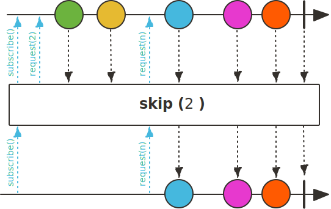

## Sequence 필터링 Operator

### filter()

filter() Operator는 Upstream에서 emit된 데이터 중에서 조건에 일치하는 데이터만 Downstream으로 emit합니다. 즉, filter() Operator의 파라미터로 입력 받은 Predicate의 리턴 값이 true인 데이터만 Downstream으로 emit합니다.

~~~java
class FilterExample{
    public static void main(String[] args) {
        Flux.range(1, 10)
            .filter(data -> data % 2 != 0)
            .subscribe(data -> log.info("# onNext: {}", data));
    }
}
~~~
~~~
12:16 [main] - # onNext: 1
12:16 [main] - # onNext: 3
12:16 [main] - # onNext: 5
12:16 [main] - # onNext: 7
12:16 [main] - # onNext: 9
12:16 [main] - # onNext: 11
12:16 [main] - # onNext: 13
12:16 [main] - # onNext: 15
12:16 [main] - # onNext: 17
12:16 [main] - # onNext: 19
~~~

### filterWhen()

 filterWhen()은 filter() Operator와는 다르게 비동기적으로 각 데이터를 평가합니다. filterWhen()은 파라미터로 Publisher<Boolean>을 반환하는 Function을 받습니다. 이 Publisher를 이용하여 비동기로 평가를 합니다. 평가 결과로 true라면 filterWhen()의 Upstream으로부터 전달받은 데이터를 DownStream으로 emit합니다.

~~~java
class FilterWhenExample{
    public static void main(String[] args) {
        Flux.range(1,20)
            .filterWhen(data -> Mono.just(data % 2 == 0).publishOn(Schedulers.boundedElastic()))
            .subscribe(data -> log.info("data: {}", data));

        Thread.sleep(10000);
    }
}
~~~
~~~
23:55 [boundedElastic-2] - data: 2
23:55 [boundedElastic-2] - data: 4
23:55 [boundedElastic-2] - data: 6
23:55 [boundedElastic-2] - data: 8
23:55 [boundedElastic-2] - data: 10
23:55 [boundedElastic-2] - data: 12
23:55 [boundedElastic-2] - data: 14
23:55 [boundedElastic-2] - data: 16
23:55 [boundedElastic-2] - data: 18
23:55 [boundedElastic-2] - data: 20
~~~

### skip()

skip() Operator는 Upstream에서 emit된 데이터 중에서 파라미터로 입력받은 숫자만큼 건너뛴 후, 나머지 데이터를 Downstream으로 emit합니다.

~~~java
class SkipExample{
    public static void main(String[] args) {
        Flux.interval(Duration.ofSeconds(2))
            .skip(2)
            .subscribe(data -> log.info("onNext: {}", data));

        Thread.sleep(10000);
    }
}
~~~
~~~
29:58 [parallel-1] - onNext: 2
30:00 [parallel-1] - onNext: 3
30:02 [parallel-1] - onNext: 4
~~~

### take()

skip() Operator가 Upstream에서 emit된 데이터 중에서 파라미터로 입력받은 숫자만큼 건너뛴 후 나머지 데이터를 Downstream으로 emit하는 반면, take() Operator는 Upstream에서 emit되는 데이터 중에서 파라미터로 입력받은 숫자 만큼만 Downstream으로 emit합니다.

~~~java
class TakeExample{
    public static void main(String[] args) {
        Flux.interval(Duration.ofSeconds(1))
            .take(3)
            .subscribe(data -> log.info("onNext: {}", data));

        Thread.sleep(5000);
    }
}
~~~
~~~
54:45 [parallel-1] - onNext: 0
54:46 [parallel-1] - onNext: 1
54:47 [parallel-1] - onNext: 2
~~~

### next()

next() Operator는 Upstream에서 emit되는 데이터 중에서 첫 번째 데이터만 Downstream으로 emit합니다. 만일 Upstream에서 emit되는 데이터가 empty라면 Downstream으로 empty Mono를 emit합니다.

~~~java
class NextExample{
    public static void main(String[] args) {
        List<Tuple2<String, Integer>> coin = List.of(
            Tuples.of("BTC", 100),
            Tuples.of("ETH", 200),
            Tuples.of("XRP", 300),
            Tuples.of("BCH", 400),
            Tuples.of("LTC", 500)
        );

        Flux.fromIterable(coin)
            .next()
            .subscribe(tuple -> log.info(tuple.getT1() + " : " + tuple.getT2()));
    }
}
~~~
~~~
46:35 [main] - BTC : 100
~~~

> 참고 :
>
> 스프링으로 시작하는 리액티브 프로그래밍(https://product.kyobobook.co.kr/detail/S000201399476)