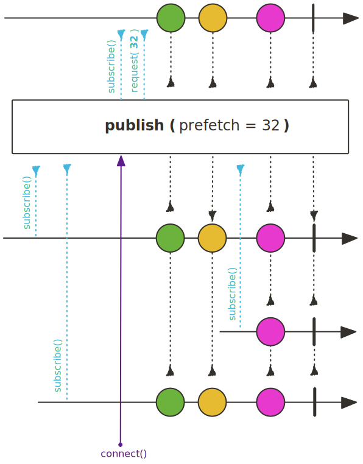
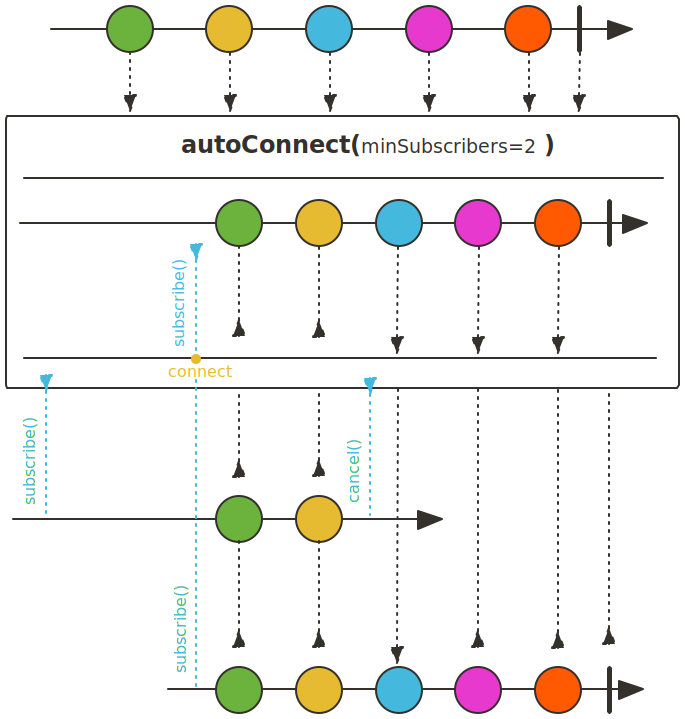
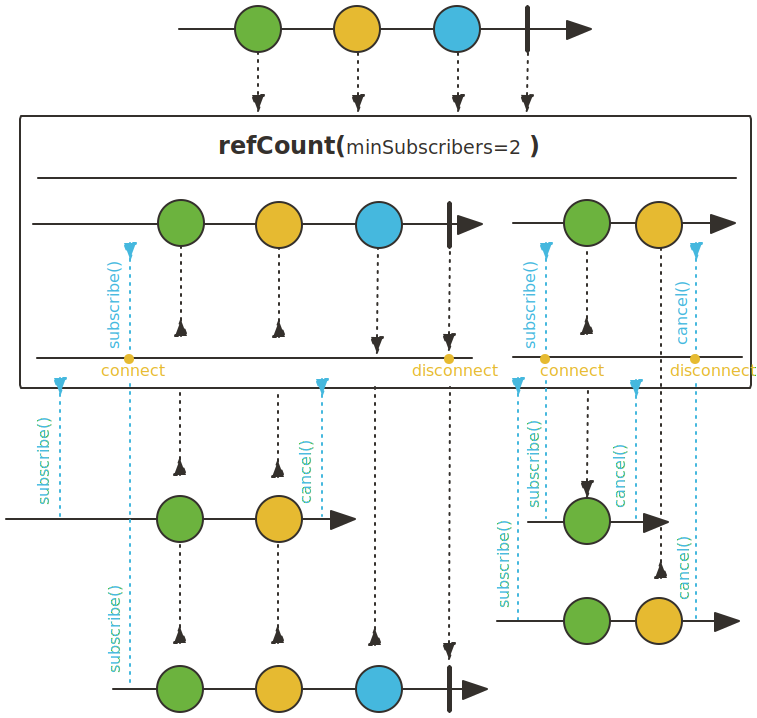

## 다수의 Subscriber에게 Flux를 멀티캐스팅(Multicasting)하기 위한 Operator

Reactor에서는 다수의 Subscriber에게 Flux를 멀티캐스팅하기 위한 Operator를 지원합니다. 즉, Subscriber가 구독을 하면 Upstream에서 emit된 데이터가 구독중인 모든 Subscriber에게 멀티캐스팅되는데, 이를 가능하게 해주는 Operator들은 Cold Sequence를 Hot Sequence로 동작하게 하는 특징이 있습니다.

### publish()

publish() Operator는 구독을 하더라도 구독 시점에 즉시 데이터를 emit하지 않고, connect()를 호출하는 시점에 비로소 데이터를 emit합니다.

그리고 Hot Sequence로 변환되기에 구독 시점 이후에 emit된 데이터만 전달받을 수 있습니다.

~~~java
class PublishExample{
    public static void main(String[] args) {
        ConnectableFlux<Integer> flux = Flux.range(1, 5)
            .delayElements(Duration.ofMillis(300L))
            .publish();

        Thread.sleep(500L);
        flux.subscribe(data -> log.info("# subscriber 1 : {}", data));

        Thread.sleep(200L);
        flux.subscribe(data -> log.info("# subscriber 2 : {}", data));

        log.info("# start connect");
        flux.connect();

        Thread.sleep(1000L);
        flux.subscribe(data -> log.info("# subscriber 3 : {}", data));

        Thread.sleep(2000L);
    }
}
~~~
~~~
22:06:45:34 [main] - # start connect
22:06:45:65 [parallel-1] - # subscriber 1 : 1
22:06:45:65 [parallel-1] - # subscriber 2 : 1
22:06:45:96 [parallel-2] - # subscriber 1 : 2
22:06:45:96 [parallel-2] - # subscriber 2 : 2
22:06:46:27 [parallel-3] - # subscriber 1 : 3
22:06:46:27 [parallel-3] - # subscriber 2 : 3
22:06:46:57 [parallel-4] - # subscriber 1 : 4
22:06:46:57 [parallel-4] - # subscriber 2 : 4
22:06:46:57 [parallel-4] - # subscriber 3 : 4
22:06:46:88 [parallel-5] - # subscriber 1 : 5
22:06:46:88 [parallel-5] - # subscriber 2 : 5
22:06:46:88 [parallel-5] - # subscriber 3 : 5
~~~

### autoConnect()

publish() Operator의 경우, 구독이 발생하더라도 connect()를 직접 호출하기전까지는 데이터를 emit하지 않기 때문에 코드상에서 connect()를 직접 호출해야 합니다.
반면, autoConnect() Operator는 파라미터로 지정하는 숫자만큼의 구독이 발생하는 시점에 Upstream 소스에 자동으로 연결되기 때문에 별도의 Connect() 호출이 필요하지 않습니다.

~~~java
class AutoConnectExample{
    public static void main(String[] args) {
        Flux<String> publisher = Flux.just("Concert part1", "Concert part2", "Concert part3")
            .delayElements(Duration.ofMillis(300L))
            .publish()
            .autoConnect(2);

        Thread.sleep(500L);
        publisher.subscribe(data -> log.info("# audience 1 is watching {}", data));

        Thread.sleep(500L);
        publisher.subscribe(data -> log.info("# audience 2 is watching {}", data));

        Thread.sleep(500L);
        publisher.subscribe(data -> log.info("# audience 3 is watching {}", data));

        Thread.sleep(1000L);
    }
}
~~~
~~~
22:12:8:49 [parallel-1] - # audience 1 is watching Concert part1
22:12:8:49 [parallel-1] - # audience 2 is watching Concert part1
22:12:8:79 [parallel-2] - # audience 1 is watching Concert part2
22:12:8:79 [parallel-2] - # audience 2 is watching Concert part2
22:12:8:79 [parallel-2] - # audience 3 is watching Concert part2
22:12:9:10 [parallel-3] - # audience 1 is watching Concert part3
22:12:9:10 [parallel-3] - # audience 2 is watching Concert part3
22:12:9:10 [parallel-3] - # audience 3 is watching Concert part3
~~~

### refCount()

refCount() Operator는 파라미터로 입력된 숫자만큼의 구독이 발생하는 시점에 Upstream 소스에 연결되며, 모든 구독이 취소되거나 Upstream의 데이터 emit이 종료되면 연결이 해제됩니다.

refCount() Operator는 주로 무한 스트림 상황에서 모든 구독이 취소될 경우 연결을 해제하는 데 사용할 수 있습니다.

~~~java
class RefCountExample{
    public static void main(String[] args) {
        Flux<Long> publisher = Flux.interval(Duration.ofMillis(500))
            .publish().refCount(2);

        Disposable disposable1 = publisher.subscribe(data -> log.info("# subscriber 1 : {}", data));

        Thread.sleep(2000L);

        Disposable disposable2 = publisher.subscribe(data -> log.info("# subscriber 2 : {}", data));

        Thread.sleep(1000L);

        disposable1.dispose();

        Thread.sleep(1000L);

        disposable2.dispose();

        Thread.sleep(5000L);
    }
}
~~~
~~~
22:19:9:44 [parallel-1] - # subscriber 1 : 0
22:19:9:44 [parallel-1] - # subscriber 2 : 0
22:19:9:94 [parallel-1] - # subscriber 1 : 1
22:19:9:94 [parallel-1] - # subscriber 2 : 1
22:19:10:43 [parallel-1] - # subscriber 2 : 2
22:19:10:94 [parallel-1] - # subscriber 2 : 3
~~~

> 참고 :
>
> 스프링으로 시작하는 리액티브 프로그래밍(https://product.kyobobook.co.kr/detail/S000201399476)