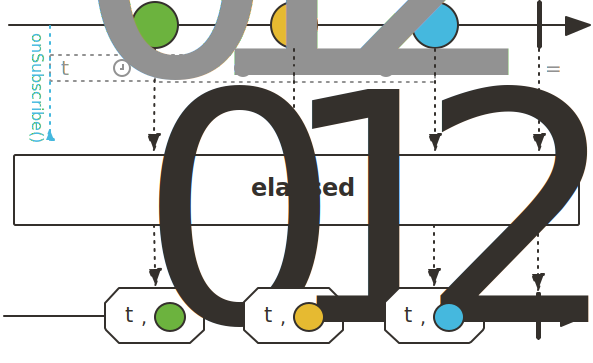

## Sequence의 동작 시간 측정을 위한 Operator

### elapsed()

elapsed() Operator는 emit된 데이터 사이의 경과 시간을 측정해서 Tuple<Long, T> 형태로 Downstream에 emit합니다.

emit되는 첫 번째 데이터는 onSubscribe Signal과 첫 번째 데이터 사이를 기준으로 시간을 측정합니다. 측정된 시간의 단위는 milliseconds입니다.

~~~java
class ElapsedExample{
    public static void main(String[] args) {
        Flux.range(1, 5)
            .delayElements(Duration.ofSeconds(1))
            .elapsed()
            .subscribe(data -> log.info("# onNext: {}, time: {}", data.getT2(), data.getT1()));

        Thread.sleep(7000);
    }
}
~~~
~~~
21:11:16:21 [parallel-1] - # onNext: 1, time: 1004
21:11:17:21 [parallel-2] - # onNext: 2, time: 1005
21:11:18:21 [parallel-3] - # onNext: 3, time: 1001
21:11:19:22 [parallel-4] - # onNext: 4, time: 1005
21:11:20:22 [parallel-5] - # onNext: 5, time: 1006
~~~

> 참고 :
>
> 스프링으로 시작하는 리액티브 프로그래밍(https://product.kyobobook.co.kr/detail/S000201399476)