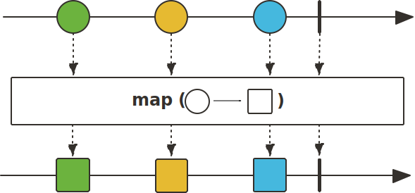

## Sequence 변환 Operator

### map()

map() Operator는 Upstream에서 emit된 데이터를 mapper Function을 사용하여 변환한 후, Downstream으로 emit합니다. 그리고 map() Operator 내부에서 에러 발생 시 Sequence가 종료되지 않고 계속 진행되도록 하는 기능을 지원합니다.

~~~java
class MapExample{
    public static void main(String[] args) {
        Flux.just("1-Circle", "3-Circle", "5-Circle")
            .map(data -> data.replace("Circle", "Rectangle"))
            .subscribe(data -> log.info("# onNext: {}",data));
    }
}
~~~
~~~
50:06 [main] - # onNext: 1-Rectangle
50:06 [main] - # onNext: 3-Rectangle
50:06 [main] - # onNext: 5-Rectangle
~~~

### flatMap()

flatMap() Operator는 Upstream에서 emit된 데이터를 전달받으면 내부의 Sequence로 데이터를 가공하여 하나 이상의 데이터를 Downstream으로 emit 합니다. 이 과정에서 Upstream에서 emit되는 데이터에 대해 각각 Sequence가 생성됨을 알 수 있습니다. 마지막으로 내부 Sequence에서 생성되는 데이터가 Downsrteam으로 평탄화되어 하나의 Sequence로 병합됩니다. 

flatMap() Operator는 내부의 Sequence를 사용하기에 비동기적으로 처리할 수 있습니다.

~~~java
class FlatMapExample{
    public static void main(String[] args) {
        Flux.range(2,4)
            .flatMap(dan -> Flux
                .range(1,4)
                .publishOn(Schedulers.parallel())
                .map(n -> dan +"*"+n+" = "+dan*n))
            .subscribe(data -> log.info("{}",data));

        Thread.sleep(4000);
    }
}
~~~
~~~
06:14 [parallel-3] - 4*1 = 4
06:14 [parallel-3] - 2*1 = 2
06:14 [parallel-3] - 2*2 = 4
06:14 [parallel-3] - 2*3 = 6
06:14 [parallel-3] - 2*4 = 8
06:14 [parallel-3] - 3*1 = 3
06:14 [parallel-3] - 3*2 = 6
06:14 [parallel-3] - 3*3 = 9
06:14 [parallel-3] - 3*4 = 12
06:14 [parallel-3] - 5*1 = 5
06:14 [parallel-3] - 5*2 = 10
06:14 [parallel-3] - 5*3 = 15
06:14 [parallel-3] - 5*4 = 20
06:14 [parallel-3] - 4*2 = 8
06:14 [parallel-3] - 4*3 = 12
06:14 [parallel-3] - 4*4 = 16
~~~

### concat()

concat() Operator는 파라미터로 입력되는 Publisher의 Sequence를 연결해서 데이터를 순차적으로 emit합니다.
특히 먼저 입력된 Publisher의 Sequence가 종료될 때까지 나머지 Publisher의 Sequence는 subscribe되지 않고 대기하는 특성을 가집니다.

~~~java
class ConcatExample{
    public static void main(String[] args) {
        Flux.concat(Flux.just(1,2,3), Flux.just(4,5,6))
            .subscribe(data -> log.info("# onNext: {}",data));
    }
}
~~~
~~~
32:59 [main] - # onNext: 1
32:59 [main] - # onNext: 2
32:59 [main] - # onNext: 3
32:59 [main] - # onNext: 4
32:59 [main] - # onNext: 5
32:59 [main] - # onNext: 6
~~~

### merge()

merge() Operator는 파라미터로 입력되는 Publisher의 Sequence에서 emit된 데이터를 인터리빙 방식으로 병합합니다.

merge() Operator는 concat() Operator처럼 먼저 입력된 Publisher의 Sequence가 종료될 때까지 나머지 Publisher의 Sequence가 subscribe되지 않고 기다리는 것이 아닌 모든 Publisher의 Sequence가 즉시 subscribe됩니다.

~~~java
class MergeExample{
    public static void main(String[] args) {
        Flux.merge(
            Flux.just(1,2,3,4).delayElements(Duration.ofMillis(300)),
            Flux.just(5,6,7).delayElements(Duration.ofMillis(500))
        ).subscribe(data -> log.info("# onNext: {}",data));

        Thread.sleep(4000);
    }
}
~~~
~~~
44:49 [parallel-1] - # onNext: 1
44:49 [parallel-2] - # onNext: 5
44:49 [parallel-3] - # onNext: 2
44:49 [parallel-5] - # onNext: 3
44:50 [parallel-4] - # onNext: 6
44:50 [parallel-6] - # onNext: 4
44:50 [parallel-7] - # onNext: 7
~~~

|       |  300ms  |  500ms  |  600ms  |  900ms  |  1000ms  |  1200ms  |  1500ms  |
|-------|:-------:|:-------:|:-------:|:-------:|:--------:|:--------:|:--------:|
| Flux1 |    1    |         |    2    |    3    |          |    4     |          |
| Flux2 |         |    5    |         |         |    6     |          |    7     |

### zip()

zip() Operator는 파라미터로 입력되는 Publisher Sequence에서 emit된 데이터를 결합하는데, 각 Publisher가 데이터를 하나씩 emit할 때까지 기다렸다가 결합합니다.

데이터 베이스에서 여러 데이터를 가져와 합치는 과정에서 사용할 수 있습니다. 이 과정에서 데이터를 가져오는데 시간이 가장 오래걸리는 Publisher 기준으로 데이터가 처리됩니다.

~~~java
class ZipExample{
    public static void main(String[] args) {
        Flux.zip(
                Flux.just(1, 2, 3, 4).delayElements(Duration.ofMillis(300)),
                Flux.just(5, 6, 7, 8).delayElements(Duration.ofMillis(500))
            )
            .subscribe(data -> log.info("# onNext: {}", data));

        Thread.sleep(4000);
    }
}
~~~
~~~
16:03:41:18 [parallel-2] - # onNext: [1,5]
16:03:41:69 [parallel-4] - # onNext: [2,6]
16:03:42:19 [parallel-7] - # onNext: [3,7]
16:03:42:69 [parallel-8] - # onNext: [4,8]
~~~

zip() Operator의 경우 파라미터로 BiFunction 인터페이스를 지정해주면 각 결합된 데이터에 대해서 추가적인 처리를 할 수 있습니다.

~~~java
class ZipExample{
    public static void main(String[] args) {
        Flux.zip(
                Flux.just(1, 2, 3, 4).delayElements(Duration.ofMillis(300)),
                Flux.just(5, 6, 7, 8).delayElements(Duration.ofMillis(500)),
                multi()
            )
            .subscribe(data -> log.info("# onNext: {}", data));

        Thread.sleep(4000);    
    }

    static BiFunction<Integer, Integer, Integer> multi(){
        return (num1,num2) -> num1*num2;
    }
}
~~~
~~~
16:09:20:10 [parallel-2] - # onNext: 5
16:09:20:61 [parallel-4] - # onNext: 12
16:09:21:12 [parallel-7] - # onNext: 21
16:09:21:62 [parallel-8] - # onNext: 32
~~~

### and()

and() Operator는 Mono의 Complete Signal과 파라미터로 입력된 Publisher의 Complete Signal을 결합하여 새로운 Mono<Void>를 반환합니다. 즉, Mono와 파라미터로 입력된 Publisher의 Sequence가 모두 종료되었음을 Subscriber에게 알릴 수 있습니다.

and() Operator는 모든 작업이 끝난 시점에 최종적으로 후처리 작업을 수행하기 적합한 Operator입니다.

~~~java
class AndExample{
    public static void main(String[] args) {
        Mono.just("Task 1").delayElement(Duration.ofSeconds(1))
            .doOnNext(data -> log.info("# Mono doOnNext: {}", data))
            .and(Flux
                .just("Task 2", "Task 3")
                .delayElements(Duration.ofMillis(600))
                .doOnNext(data -> log.info("# Flux doOnNext: {}", data))
            )
            .subscribe(
                data -> log.info("# onNext: {}", data),
                error -> log.info("# onError: {}", error),
                () -> log.info("# onComplete")
            );
        Thread.sleep(4000);
    }
}
~~~
~~~
16:27:25:98 [parallel-2] - # Flux doOnNext: Task 2
16:27:26:38 [parallel-1] - # Mono doOnNext: Task 1
16:27:26:59 [parallel-3] - # Flux doOnNext: Task 3
16:27:26:59 [parallel-3] - # onComplete
~~~

### collectList()

collectList() Operator는 Flux에서 emit된 데이터를 모아서 List로 변환한 후, 변환된 List를 emit하는 Mono를 반환합니다. 만약 Upstream Sequence가 비어있다면 비어 있는 List를 Downstream으로 emit합니다.

~~~java
class CollectListExample{
    public static void main(String[] args) {
        Flux.just("...", "---", "...")
            .map(CollectListExample::transformMorseCode)
            .collectList()
            .subscribe(listMono -> log.info("{}",listMono));

        Thread.sleep(4000);
    }

    static String transformMorseCode(String code) {
        if (code.equals("---")) return "O";
        else if (code.equals("...")) return "S";
        throw new RuntimeException("Not Found Code");
    }
}
~~~
~~~
16:37:10:83 [main] - [S, O, S]
~~~

### collectMap()

collectMap() Operator는 Flux에서 emit된 데이터를 기반으로 key와 value를 생성하여 Map의 Element로 추가한 후, 최종적으로 Map을 emit하는 Mono를 반환합니다.

 만약 Upstream Sequence가 비어 있다면 비어 있는 Map을 Downstream으로 emit합니다. 

> 참고 :
>
> 스프링으로 시작하는 리액티브 프로그래밍(https://product.kyobobook.co.kr/detail/S000201399476)
