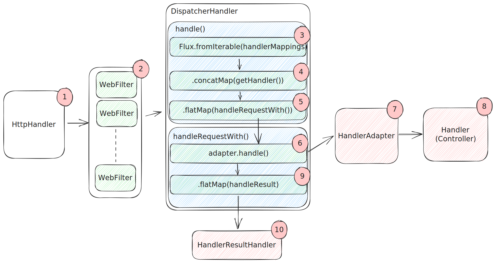

# WebFlux

## WebFlux 목차

> [1. WebFlux 핵심 컴포넌트](https://github.com/tlarbals824/TIL/blob/main/spring/WebFlux/WebFluxMainComponent.md)
> 
> [2. WebFlux의 Non-Blocking 프로세스 구조](https://github.com/tlarbals824/TIL/blob/main/spring/WebFlux/WebFluxNonBlockingProcessStructure.md)

## WebFlux란?

WebFlux가 만들어진 이유는 다음과 같습니다.
1. 적은 H/W 리소스를 이용하여 동시성을 다루기 위한 비동기 웹 스택이 필요했습니다.
2. 함수형 프로그래밍에 대한 지원입니다. 자바 5에서 애노테이션에 대한 지원이 추가되었고, 자바 8 이후로는 람다 표현식이 추가됨에 따라 자바에서 함수형 API을 지원할 수 있게 되었습니다. 이에 따라 비동기 선언적 프로그래밍이 가능한 비동기 애플리케이션과 CPA(continuation-style APIs)에 이점으로 작용했습니다.

>Part of the answer is the need for a non-blocking web stack to handle concurrency with a small number of threads and scale with fewer hardware resources. Servlet non-blocking I/O leads away from the rest of the Servlet API, where contracts are synchronous (Filter, Servlet) or blocking (getParameter, getPart). This was the motivation for a new common API to serve as a foundation across any non-blocking runtime. That is important because of servers (such as Netty) that are well-established in the async, non-blocking space.
>
> The other part of the answer is functional programming. Much as the addition of annotations in Java 5 created opportunities (such as annotated REST controllers or unit tests), the addition of lambda expressions in Java 8 created opportunities for functional APIs in Java. This is a boon for non-blocking applications and continuation-style APIs (as popularized by CompletableFuture and ReactiveX) that allow declarative composition of asynchronous logic. At the programming-model level, Java 8 enabled Spring WebFlux to offer functional web endpoints alongside annotated controllers.

이에 따라 WebFlux에 경우 애노테이션 기반 controller와 함수형 endpoint를 모두 지원합니다.

## WebFlux의 기술 스택

* 서버 : Spring WebFlux는 MVC와는 다르게 Non-Blocking I/O 방식으로 동작하는 Netty 등의 서버 엔진에서 동작합니다.
* 서버 API : Spring MVC의 경우 Servlet API를 사용하지만 WebFlux에 경우 Netty 등 비동기 서버 엔진에서 제공하는 Reactive Streams Adapter를 통해 Reactive Streams를 지원합니다.
* Security : Spring Security는 MVC에서는 Filter기반으로 동작하는데 반에 WebFlux에서는 Webfilter기반으로 동작합니다.
* 데이터 액세스 : Spring MVC에서는 JDBC, JPA등을 지원하지만 WebFlux에서는 R2DBC, Reactive MongoDB등을 지원합니다.

## WebFlux의 요청 흐름

1. 클라이언트로의 요청이 들어오면 Netty 서버를 거쳐 HttpHandler가 요청을 전달받습니다. 이때 각 서버 엔진들이 제공하는 API를 통해 ServerHttpRequest와 ServerHttpResponse를 포함하는 ServerWebExchange를 WebFliter 체인으로 전달합니다.
2. ServerWebExchange는 WebFilter에서 전처리 과정을 거친 후, WebHandler 구현체인 DispatcherHandler에게 전달됩니다.
3. Spring MVC의 DispatcherServlet과 유사한 역할을 하는 DispatcherHandler에서는 handle() 메소드에서 HandlerMapping List를 원본 Flux의 소스로 전달받습니다.
4. ServerWebExchange를 처리할 Handler를 조회합니다.
5. 조회한 Handler의 호출을 handlerRequestWith() 메소드에 위임합니다.
6. handleRequestWith() 메소드에서 HandlerAdapter 목록을 탐색합니다.
7. 탐색한 HandlerAdapter 중, 위임받은 handler를 처리할 수 있는 HandlerAdapter를 통해 ServerWebExchange를 처리할 Handler를 호출합니다.
8. Controller 또는 HandlerFunction 형태의 요청을 처리한 후, 응답 데이터를 리턴합니다.
9. 핸들러로부터 리턴받은 응답 데이터를 처리할 HandlerResultHandler를 조회합니다.
10. 조회한 HandlerResultHandler가 응답 데이터를 적절하게 처리한 후, response로 리턴합니다.

> 참고 :
>
> 스프링으로 시작하는 리액티브 프로그래밍(https://product.kyobobook.co.kr/detail/S000201399476)