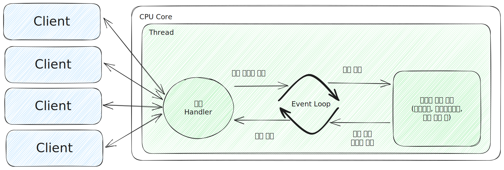

## Spring WebFlux의 Non-Blocking 프로세스 구조

Spring MVC와 Spring WebFlux는 동시성 모델과 스레드에 대한 기본 전략에서 많은 차이점을 보입니다.

Blocking I/O 방식의 Spring MVC는 요청을 처리하는 스레드가 차단될 수 있기 때문에 기본적으로 대용량의 스레드 풀을 사용해서 하나의 요청을 하나의 스레드가 처리합니다.

반면 Non-Blocking I/O 방식의 Spring WebFlux는 스레드가 차단되지 않기 때문에 적은 수의 고정된 스레드 풀을 사용해서 더 많은 요청을 처리합니다.

이처럼 Spring WebFlux가 스레드 차단 없이 더 많은 요청을 처리할 수 있는 이유는 요청 처리 방식으로 이벤트 루프 방식을 사용하기 때문입니다.

### WebFlux Non-Blocking 프로세스

Non-Blocking 프로세스는 다음과 같습니다.
1. 클라이언트로부터의 요청을 요청 Handler가 전달 받습니다.
2. 전달받은 요청을 이벤트 루프에 푸시합니다.
3. 이벤트 루프는 네트워크, 데이터베이스 연결 작업 등 비용이 드는 작업에 대한 콜백을 등록합니다.
4. 작업이 완료되면 완료 이벤트 루프에 푸시합니다.
5. 등록한 콜백을 호출해 처리 결과를 전달합니다.

이를 통해 이벤트 루프는 단일 스레드에서 계속 실행되며, 클라이언트 요청이나 데이터베이스 I/O, 네트워크 I/O 등 모든 작업들이 이벤트로 처리되기 때문에, 이벤트 발생 시 해당 이벤트에 대한 콜백을 등록함과 동시에 다음 이벤트 처리로 넘어갑니다.

결과적으로 Spring WebFlux가 이벤트 루프 방식을 도입함으로써 적은 수의 스레드로 많은 수의 요청을 Non-Blocking 프로세스로 처리할 수 있게 되었습니다.

> 참고 :
>
> 스프링으로 시작하는 리액티브 프로그래밍(https://product.kyobobook.co.kr/detail/S000201399476)